---
{
title: "How GitHub is Improving Developer Experience",
published: "2022-04-14T11:25:47Z",
edited: "2022-04-19T08:39:23Z",
tags: ["tooling", "devexeperience", "github", "git"],
description: "Photo by Annie Spratt on Unsplash  In the last couple of years, the number of developers contributing...",
originalLink: "https://dev.to/this-is-learning/how-github-is-improving-developer-experience-8jj",
coverImg: "cover-image.png",
socialImg: "social-image.png"
}
---

Photo by <a href="https://unsplash.com/@anniespratt?utm_source=unsplash&utm_medium=referral&utm_content=creditCopyText">Annie Spratt</a> on <a href="https://unsplash.com/s/photos/developer-experience?utm_source=unsplash&utm_medium=referral&utm_content=creditCopyText">Unsplash</a>

In the last couple of years, the number of developers contributing to Open Source has grown exponentially. The Github team deserves all praise. The Developer Experience is much better than what it used to be. They are lowering the entry barrier for new developers to come and contribute to Open Source. Let's go through some great tools introduced and some amazing changes around [GitHub](https://github.com/), which improved the Developer Experience and made GitHub an undisputed leader.

# Tools

Let's go through the tools introduced in the past few years.

## Codespaces

One of the biggest problems developers face is setting up the development environment. As someone contributing to multiple Open Source projects, it's a pain, and I am sure many of you will agree with this. GitHub came up with [Codespaces](https://github.com/features/codespaces). You setup the development environment in a single click; it's amazing, isn't it? And can use it online, too; press "." and it spins up your environment on the cloud. Many Open Source developers have access to use it for free. For enterprises, you need to pay to use it, and the pricing is much cheaper than buying a high-end laptop.

## GitHub Actions

After NodeJS, this is the best thing Developer Community got. Before GitHub Actions, it was a pain to setup the CI/CD, and everyone, especially Open Source maintainers, knows this. With GitHub Actions, you can setup CI/CD for your project with ease, and even you don't need to leave the github.com. With so many Actions created by the community, you can setup your essential CI/CD within a few minutes. So what are you waiting for? Go ahead and utilize this feature, and you can publish your Actions on [marketplace](https://github.com/marketplace?type=actions)

## Code Search

Searching code on GitHub was a pain; it was slow, confusing, and sometimes we used to get results we were not looking for. GitHub launched [GitHub Code Search](https://cs.github.com/) which makes code search faster and more accurate; you can select which repo you want to search code for,

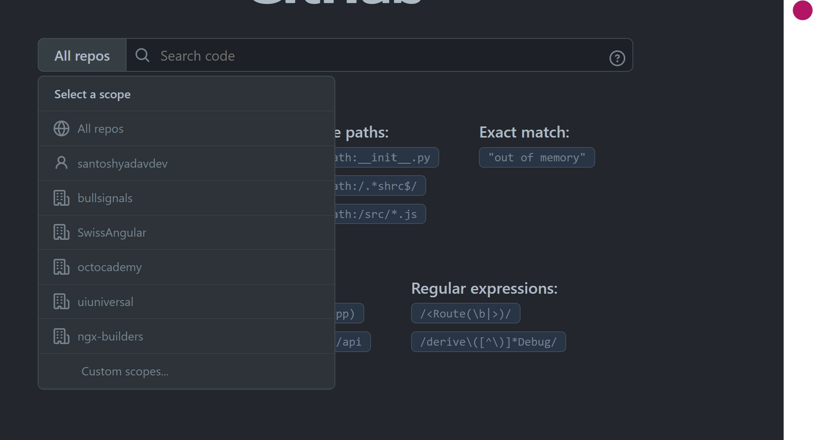

You get a lot of filters for the correct code.

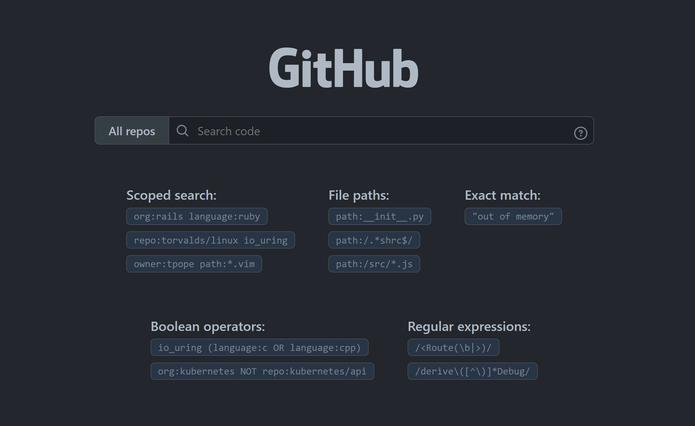

## Copilot

I am sure you already know what [Copilot](https://copilot.github.com/) is and what it can do for you. I still get amazed by what it can sometimes do; I write a single character and press the tab, and it writes the exact code that I am thinking, even better. Many developers got the access and are enjoying it, and it has improved my productivity for sure. Also, try Copilot for writing blog posts; you will be surprised.

## GitHub CLI

No, I am not talking about Git, which we use; GitHub decided to release its CLI because why not? This is the era of CLI. You can open a PR, see a PR status, see all issues, etc.
You can download it from [here](https://cli.github.com/)

## GitHub Sponsors

Not a tool but a fantastic addition to the ecosystem, funding for Open Source is a tricky topic. Many large enterprises use them but don't care to support them. GitHub sponsors are trying to fill that gap, so organizations and developers know what projects they rely on and choose to sponsor projects or open-source contributors. With GitHub Sponsors, developers keep the entire money as GitHub does not charge any fee.

You can get more details [here](https://github.com/sponsors)

## GitHub Mobile App

What if you are traveling and there is an emergency, and you need to review and merge PR. GitHub mobile app has matured over the year and is available for both Android and Apple phones. It has most of the features you need to review, merge and read the code.

Download if from [here](https://github.com/mobile)

# Github.com

## Dark theme

Everyone I know was rooting for this feature. GitHub finally launched a dark theme. We have multiple themes to choose from; you can also sync them with the system setting.
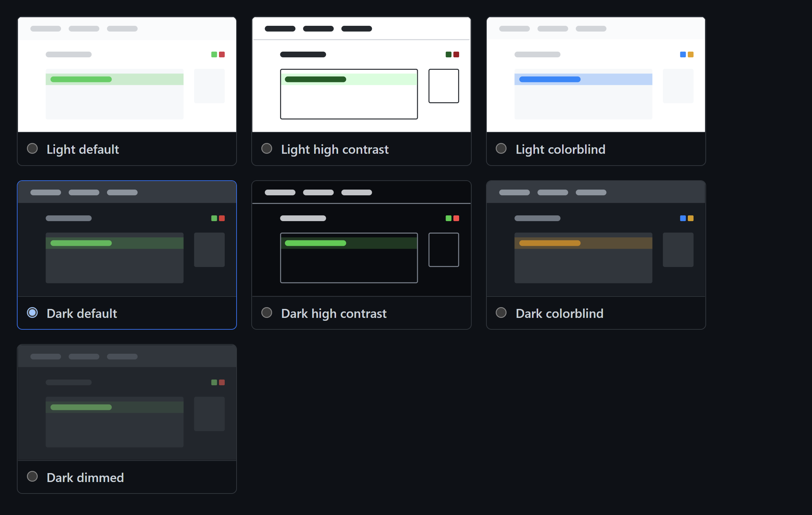

## Fetch Upstream

Keeping a fork in sync with the remote branch was always a pain. With this feature, GitHub just solved an immense pain for 1000s of contributors on GitHub.

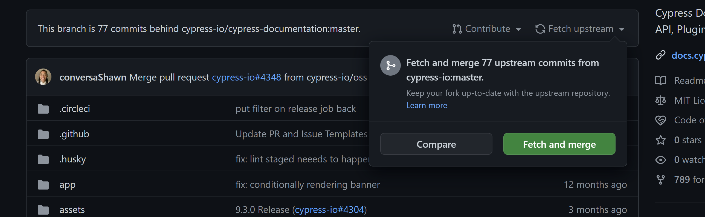

## Projects (Beta)

Everyone using GitHub relies on other tools like Jira and Azure DevOps for project management. For enterprises, it is easy to pay for a project management tool. For open source maintainers, not so much; they rely on GitHub issues. With Projects, they will be able to plan in a better way.

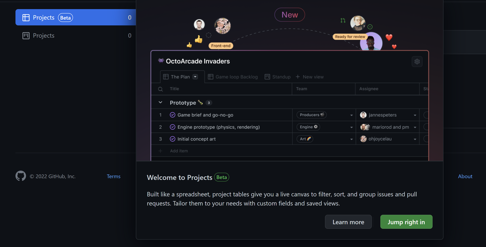

## Discussions

If you are Open Source maintainers, you know how much pain it was to manage questions and RFCs using GitHub issues. Open Source maintainers pushed developers to use StackOverflow, but was it the best choice? Open Source projects miss so much valuable content available somewhere else. In case some question on SO leads to a new Bug or a feature?

Discussions are the best place to have QnA and RFCs, and it allows to convert Discussion to issues as well. It means all information is available in the repository. Also, maintainers know who is helping the project more by getting involved in QnA.

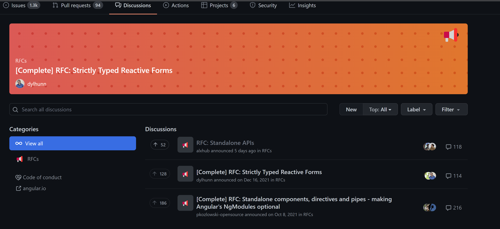

To enable Discussions for the repository, Go to Settings, and you will find the below option.

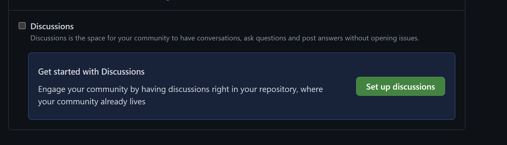

## List

I am sure, like me, many of you star a lot of repositories on GitHub. But do you remember why you starred those repositories or which one you starred once you have starred many of them?

I don't, so I was pleased when List was introduced. You can add a starred repository to an existing list or create a new List so you remember why you starred the repo.

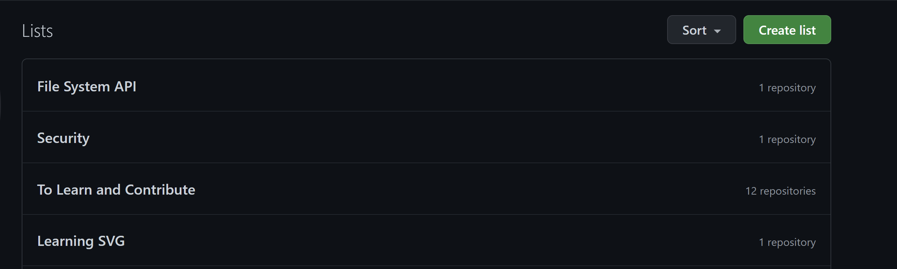

## Special Repository

GitHub has a special repository. Create a repository with the same name as your username to use it. You can use this repository to customize your GitHub profile; you can visit my profile to see an example.

https://github.com/santoshyadavdev

Also, if you want to customize yours, don't miss [this](https://www.eddiejaoude.io/course-github-profile-landing?r_done=1) free course By [Eddie](https://twitter.com/eddiejaoude)

## Update PR with remote Branch

Another big pain while doing PRs was, what if your PR takes some time to merge and the master is already ahead? Of course, you update your branch with the main branch, and you have to do it manually, which wastes the developer's time. GitHub came up with an option to update your PR with a single button click, thus saving a lot of time for developers.

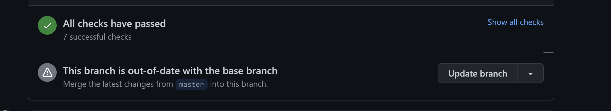

## Command Palette (Feature Preview)

Want to navigate through GitHub quickly? Use the new Command Palette. To open the command palette; use the below keys:

macOS: ⌘ k or ⌘ opt k
other: Ctrl k or Ctrl alt k

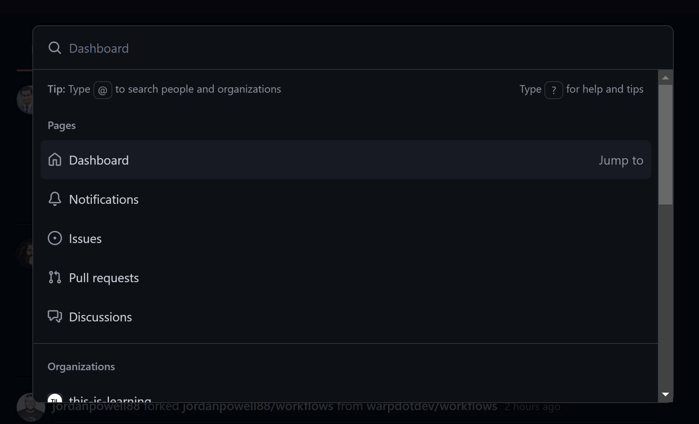

This feature is not enabled for everyone. Go to the Feature Preview tab to see if you have access to this feature.

## Pull Request File Tree (Feature Preview)

It is difficult to find and review a file when you change many files within a PR. Sometimes, the file is at the bottom of the screen, and reviewers have to scroll to see the files. With this feature, we get the files changed within the review tab, and it's easy to navigate and look for changes in a file.

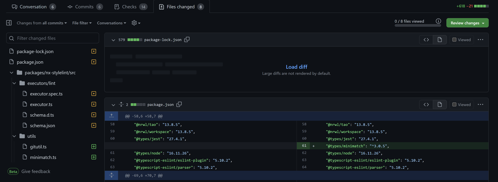

## GitHub Releases

Creating a release note is essential. It tells the users of your projects/product what the changes introduced in the new release are.
Open Source maintainers have used different approaches for years. Thanks to GitHub releases, you can do it from the repository itself. Once you draft a new release, you can choose your tag name against which branch you want to draft the release, and it will pick up all the issues included in the new release.

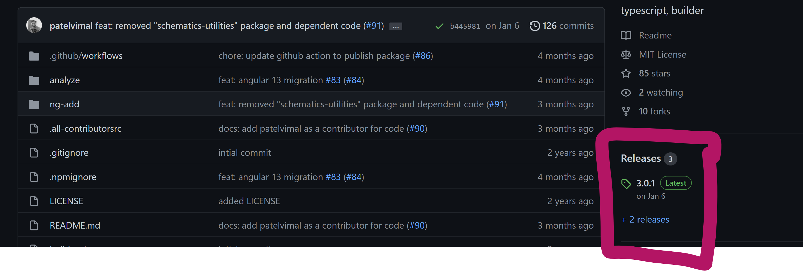

Example: https://github.com/ngx-builders/source-map-analyzer/releases/tag/3.0.1

You can watch my latest video as I created a new release for my Open Source Package

<iframe src="https://www.youtube.com/watch?v=0TsWsW0MjMc"></iframe>

## Code Navigation

I read Open Source code to understand what they do, and sometimes the reference to some functions is in another file. Before the code navigation feature landed on GitHub, the only way was to go to that file and read.
It was time-consuming with code navigation it's easy to move to another file where the code exists.

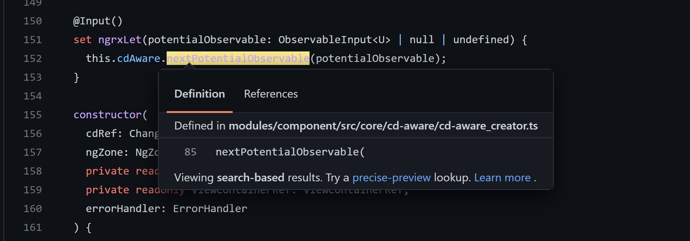

# Community Initiative

## Stars Program

In 2020 GitHub launched the [GitHub stars](https://stars.github.com/) Program to recognize the developers educating and inspiring the developers across the globe. Unlike most programs, this Program is unique, as developers worldwide can nominate you. The perk of being one of the stars, you get to give early feedback for new features and interact with a fantastic team.

Also, no one can beat the GitHub in swag, and I have almost my entire streaming setup given by GitHub. It supports you as well, so you can continue your community effort.

# Conclusion

These are a few tools and features; there are many. I recently found I can follow organizations on GitHub now. GitHub is pushing a lot of great features. Let me know which one is your favorite, and I know it isn't easy to choose.

Shoutout to my GitHub sponsors for supporting my work:

https://github.com/fahadqazi
https://github.com/jackbridger
https://github.com/ssunils
