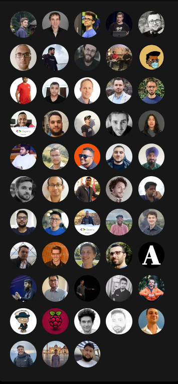
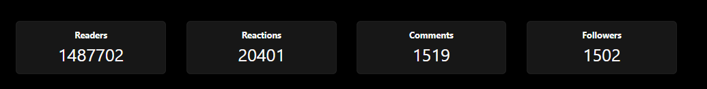
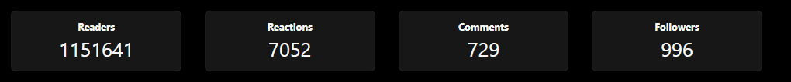
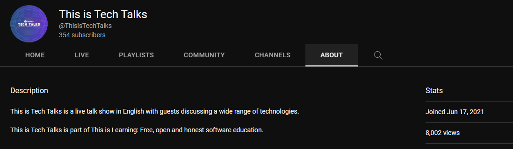

---
{
title: "How we built This is Learning Community",
published: "2023-02-27T00:15:51Z",
tags: ["authentication", "programming", "productivity", "csharp"],
description: "Photo by Clay Banks on Unsplash  This is Learning was started in 2020 by @layzee. I presented how we...",
originalLink: "https://dev.to/this-is-learning/how-we-built-this-is-learning-community-g34",
coverImg: "cover-image.png",
socialImg: "social-image.png"
}
---

Photo by <a href="https://unsplash.com/@claybanks?utm_source=unsplash&utm_medium=referral&utm_content=creditCopyText">Clay Banks</a> on <a href="https://unsplash.com/photos/LjqARJaJotc?utm_source=unsplash&utm_medium=referral&utm_content=creditCopyText">Unsplash</a>

This is Learning was started in 2020 by @layzee. I presented how we built this community at the GDE summit in Berlin in Jan 2023. Over the last 3 years, [this-is-learning](https://dev.to/this-is-learning) and [this-is-angular](https://dev.to/this-is-angular) have grown over 150+ contributors and more than 2.5M views.

# How It Started

In 2020 @layzee had a vision of starting a publication that is free and open to everyone. And he wanted to ensure everyone was free to express their views, and there should not be any gatekeeping.

I also joined the publication when it started, so I was one of the early contributors to this community.

# Joining TIL as Co-Founder

In 2020 I was running my show called [Tech Talks with Santosh](https://www.youtube.com/@TechTalksWithSantosh),  where I was streaming every week. After doing it for a year, I was getting burned out. I also called my friend [Amandeep](https://twitter.com/learn_n_share), and he suggested it's better to collaborate as you won't be able to scale it up.

When I was thinking about collaboration, there are 2 things I can do.

- Onboard someone to run Tech Talks with Santosh together, but the show was in my name, and I wanted to keep using this channel in the future.

- Collaborate with @layzee as I have known him since 2019, and admire his work for the community.

I decided to reach out to Lars and proposed that I join [this-is-learning](https://dev.to/this-is-learning), and Lars was convinced, as we can focus on more areas other than blogs.

During our call, we exchanged thoughts on the values of the community,

- We both wanted to ensure we kept the community free from any influence from outside.
- Which means we will never take sponsorship.
- Anyone interested in sharing knowledge can join the community with no gatekeeping.
- Keep the bar low. No one needs to be an expert to join our publication; dedication and effort matter.

## Other Initiatives

After joining the [this-is-learning](https://dev.to/this-is-learning) as co-founder, we decided to bring more initiatives to grow the community.
We started

- This Is Tech Talks Podcast (https://www.youtube.com/@ThisisTechTalks)
- This is Learning Newsletter (https://thisislearning.substack.com/)
- Community Discord Server (https://discord.gg/REY2x8SJYk)
- This is Angular guides (https://this-is-learning.github.io/rxjs-fundamentals-course/)
- NgRx Essentials (https://this-is-angular.github.io/ngrx-essentials-course/)
- RxJS Fundamentals (https://github.com/this-is-learning/rxjs-fundamentals-course)

## How we added more contributors

Growing a community takes work. Our motto was to have a community that promotes Free, open, and honest software education.

To grow the community, we started reaching out to folks on Twitter and LinkedIn, and we reached out to the community members who were already writing blogs.

Reaching out to community members works excellently for us. Most of the community members writing and publishing our blogs came via this channel.

We also got some great contributors, like [Deep](https://twitter.com/djgovani), who took the initiative and started writing the newsletter, which he has been writing for over a year.

We also have [Jay](https://twitter.com/JayCooperBell), who joined us as co-host for our podcast.

And 100s of other contributors who are very active in writing for the publication.

## Where are we now

The community is growing monthly, and we have seen incredible growth over the years.

The community servers crossed 300 members, and our private discord of contributors struck 150+ members.

The blog post crossed 2.5M reads.

The podcast crossed 350 subscribers and 8k views.

How to join
We run multiple initiatives, and you can help the community in several ways.

- Write blogs for TIL or TIA
- Podcast.
- Newsletter
- Help writing educational content on GitHub (https://github.com/this-is-learning)

If you want to be part of the community reach out to [Me](https://twitter.com/SantoshYadavDev) or [Lars](https://twitter.com/LayZeeDK) , our [community discord](https://discord.com/invite/WquDAakwkK) is open to everyone.
