---
{
title: "My Home Office Setup",
published: "2020-10-17T18:38:10Z",
edited: "2021-04-08T13:21:21Z",
tags: ["productivity", "career", "discuss"],
description: "Last year I started working on the home setup, which I never thought would become my home office one...",
originalLink: "https://dev.to/this-is-learning/my-home-office-setup-3l3f",
coverImg: "cover-image.png",
socialImg: "social-image.png"
}
---

Last year I started working on the home setup, which I never thought would become my home office one day.

I recently purchased a new Laptop for my Home Office Setup:

# ASUS ZenBook Duo Pro Laptop:

- The \[laptop] (https://www.amazon.in/gp/product/B083C93SNW/ref=ppx\_yo\_dt\_b\_asin\_title\_o06\_s00?ie=UTF8\&th=1) comes with Dual Screen as visible in the image above. The second image is known as ScreenPad+. You can use it as a secondary screen. Also, it comes with an app to manage your apps. Looks like below
  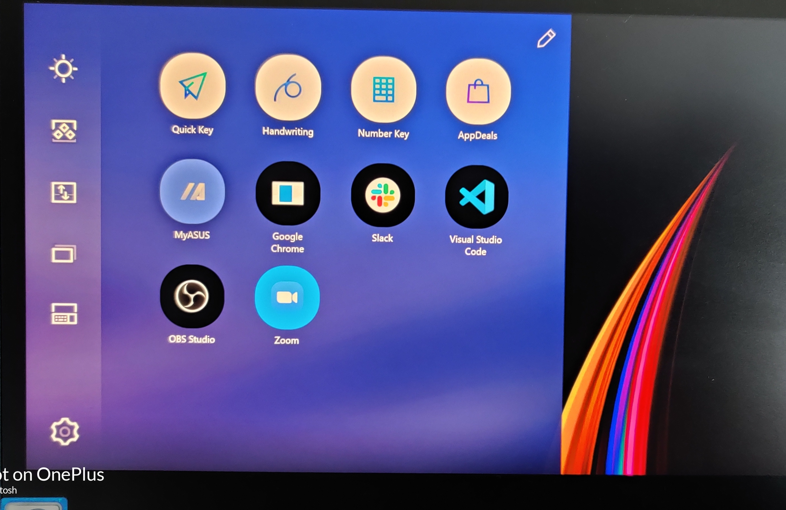
  You can drag and drop all the applications to keep your desktop clean.
- It also has the option to group multiple apps, and once you click on that group, they will start, e.g., I want VS code to open on the primary screen and on ScreenPad+ I want to open Terminal and my music app that can be done and you can add 4 shortcuts like that
  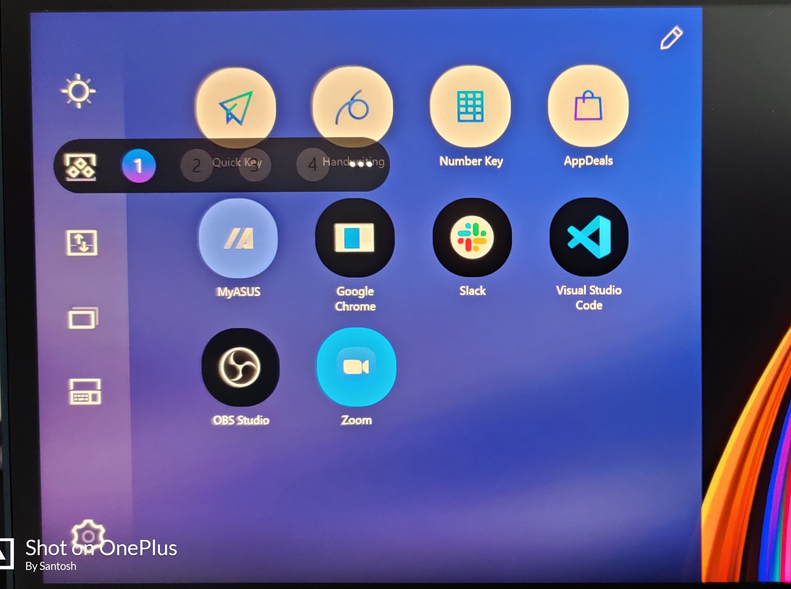
  Below, Gif shows how it works. You can open all apps you want to group and click capture. You can update that too.
  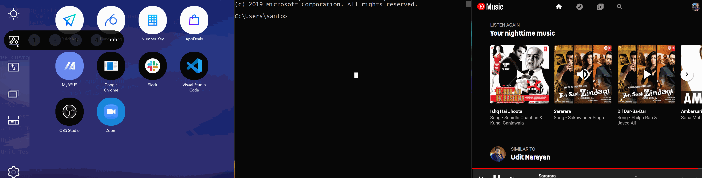
- Swap screen: Yes, you can do that too. If you want the content from screen 1 to be shifted to screen 2 and vice versa, you need to select the below option
  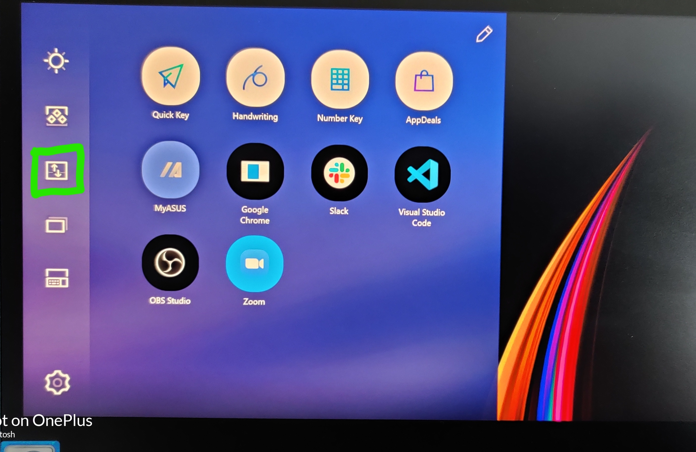
- Performance: I have been using it for a week and playing AOE (Age of Empire) a few times; no issues were found. Boot time is within seconds until there are no Windows updates.
- RAM and Storage: I was lucky to get the 2nd generation 2020 build, which has improved a lot, especially the Thunderbolt port. It has 32GB DDR4 RAM, 1 TB SSD storage.
- Screen: It has 39.62cm(15.6") OLED 4K (3840 x 2160) 16:9 touchscreen, even scrennpad+ has the same resolution and touchscreen as well. It comes with an ASUS pen, if you are a fan of using it, added advantage.
- Numpad + Touchpad: You might have noticed, there is no extra touchpad visible. The Numpad can be used as a touchpad; you can disable and enable the Numpad by pressing the key shown in the image.
  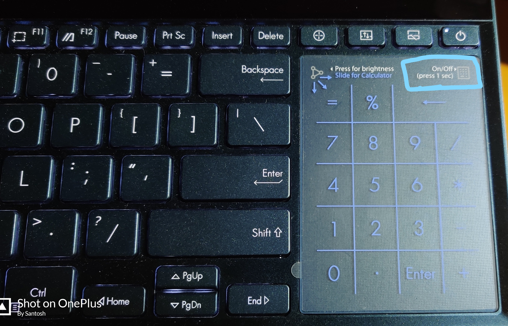
- Cooling: While playing games and running VS code and multiple browsers, I can feel the heat coming from the laptop, but in this generation, cooling is improved. It takes really less time to cool down once I stop playing the game.

I will say this laptop is worth investing in. I love it so far.

Why I purchased it? Of course, I did a lot of research before buying this one. My other 2 options were Dell XPS 17 and Lenovo Thinkpad X1 Gen 2.
I purchased this one for one additional reason, I give talks and conduct sessions online, and now I can easily open the Terminal, code snippets on my secondary screen while presenting my talks or sessions. And it will be useful even once we have in-person conferences and meetups.

# Laptop Stand

Amazon Basics products are pretty cool, and cheap so I went with \[AmazonBasics Ventilated Laptop Stand] (https://www.amazon.in/gp/product/B00WRDS8H0/ref=ppx\_yo\_dt\_b\_search\_asin\_title?ie=UTF8\&psc=1)

# Blue Yeti:

Last year I became a GitHub star, and they sent me a lot of amazing swags, Blue Yeti was on my wish list and they sent me one, I was using Blue snowball earlier.

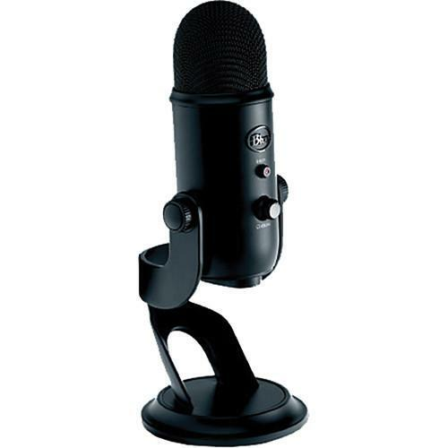

# Rode PSA1 Studio Boom Arm for Broadcast Microphones:

Blue Yeti Mic is heavy and needs a good Boom Arm, thanks to Google Devs India for sponsoring this amazing Studio Boom, I can use with Blue Yeti.

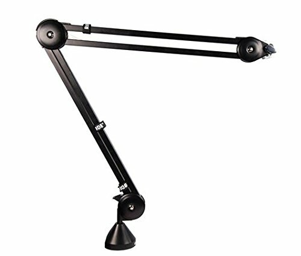

# Blue Microphones Radius III Broadcast Shockmount

If you are using Boom Arm, you need a Shockmount Radius III Broadcast Shockmount is great, and thanks again to Google Devs India for sponsoring this, which goes really well with the setup.

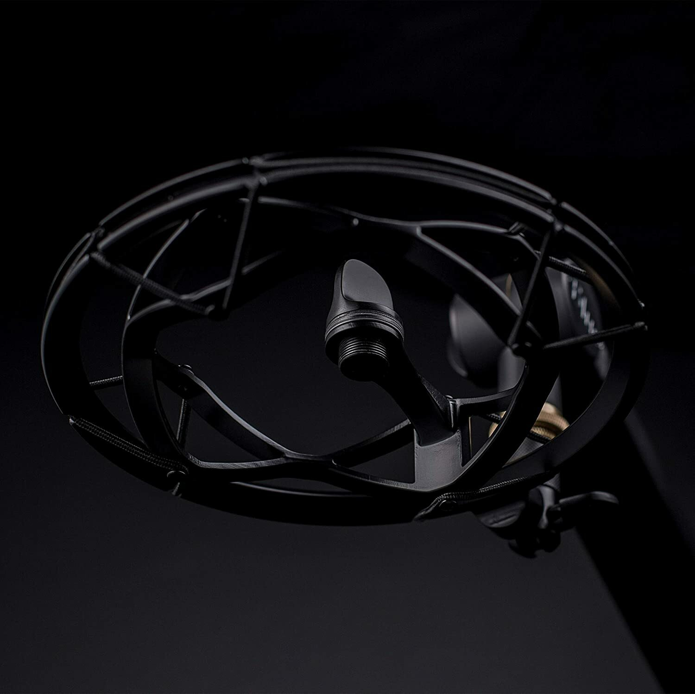

# Asus VZ249H 24-inch FHD Monitor

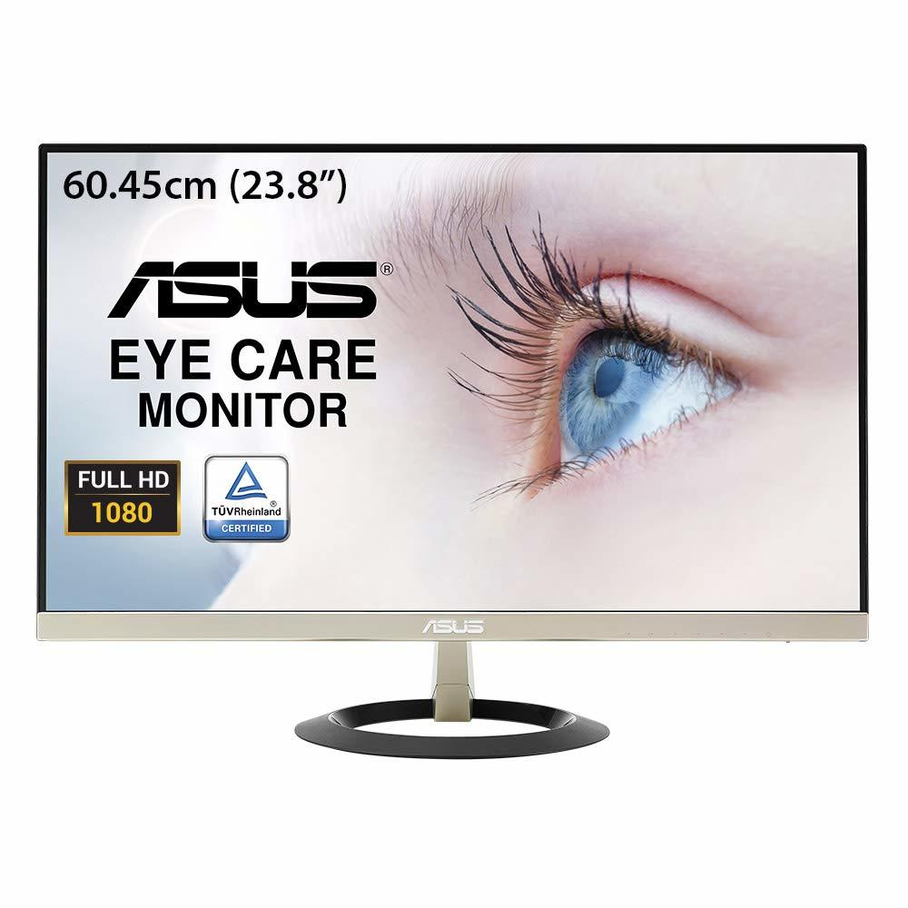

I started building my setup last year; as I mentioned, I decided to go with this 24-inch monitor and Full HD. Of course, due to budget constraint again, My first choice for a new monitor would be either \[HP EliteDisplay] (https://www.amazon.in/dp/B07CG48R8D/?coliid=I1J8XCBURXNIM1\&colid=3Q2564W89B5T2\&ref\_=lv\_ov\_lig\_dp\_it\&th=1) or any Dell UHD monitors, which are too costly or [LG 29 inch Ultrawide Full HD](https://www.amazon.in/LG-29UM69G-Ultrawide-Monitor-SPEAKERS/dp/B0793KVRH4/ref=sr_1_8?dchild=1\&keywords=monitors\&qid=1602957838\&refinements=p_89%3ALG\&rnid=3837712031\&s=computers\&sr=1-8)

# Keyboard and Mouse

I like using a USB keyboard and mouse.

\[Logitech K230 Compact Wireless Keyboard] (https://www.amazon.in/gp/product/B01267B9CW/ref=ppx\_yo\_dt\_b\_search\_asin\_title?ie=UTF8\&psc=1)

\[Logitech M590 Silent Wireless Mouse] (https://www.amazon.in/gp/product/B075TW2K6P/ref=ppx\_yo\_dt\_b\_search\_asin\_title?ie=UTF8\&psc=1)

The mouse is silent, and the keyboard does not make much sound, which is good to record videos.

# Green Screen and Stand:

I needed a green screen to use Virtual background for my talks. I use StreamYard for streaming and use a background image.

\[Hanumex Green Backdrop] (https://www.amazon.in/gp/product/B00JHN6DFM/ref=ppx\_yo\_dt\_b\_search\_asin\_title?ie=UTF8\&psc=1)

\[SONIA Photography Stand Kit] (https://www.amazon.in/gp/product/B07DBBDDKB/ref=ppx\_yo\_dt\_b\_search\_asin\_title?ie=UTF8\&psc=1)

# Cable Management

Once you have these many things, the biggest problem is you have a lot of cables visible. For cable management, I was using \[InstaNeat Cable Management Box] (https://www.amazon.in/gp/product/B07FCKFPGZ/ref=ppx\_yo\_dt\_b\_search\_asin\_title?ie=UTF8\&psc=1), which I moved in my hall for other stuff, and currently using \[ORICO Cable Management Box] (https://www.amazon.in/gp/product/B085ZWF9TQ/ref=ppx\_yo\_dt\_b\_search\_asin\_title?ie=UTF8\&psc=1)

# Headphone

I tried many USB headphones, but none of them were good, I use
\[Sennheiser PC 8 Over-Ear USB VOIP Headphone] (https://www.amazon.in/gp/product/B005HWEZGG/ref=ppx\_yo\_dt\_b\_search\_asin\_title?ie=UTF8\&psc=1) just for the Audio Input

# Webcam

For a long time, I wanted to buy a great webcam and Logitech Brio was on my wishlist and GitHub made that wish come true last year by sending me Logitech Brio, and I simply love it, the clarity is amazing.

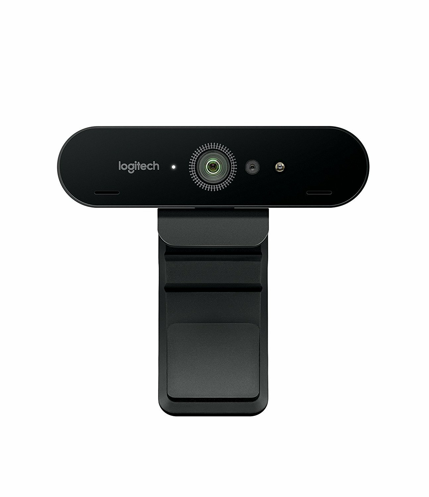

# Elgato key light

Streaming is incomplete without good lighting and thanks again to GitHub for sending me the Elgato key light. All my videos have better light.

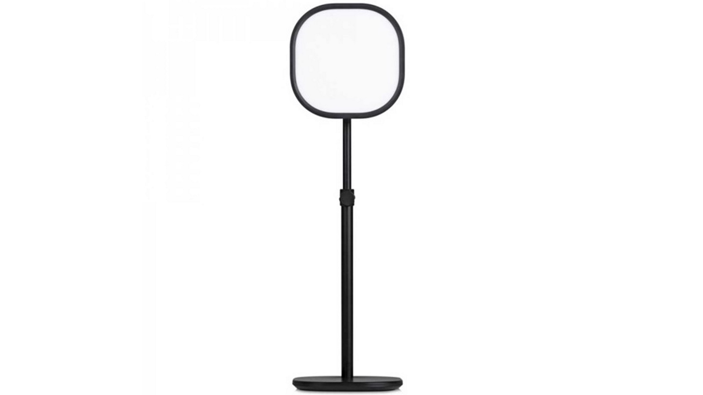

# Standing Desk (SMART LIFT ELECTRIC 2)

I was looking for a standing desk for a long time, and finally one of my friends suggested me "ebco", they have showrooms in most of the cities and I purchased one from them recently.

Here is the link, if you want to buy one https://ebco.in/products/worksmart/office-furniture-fittings/smart-lifts/smart-lift-electric-2-2-stage-anti-collision-3-memory-setting
