---
{
title: "My year in review",
published: "2022-12-14T23:02:02Z",
edited: "2022-12-15T09:30:08Z",
tags: ["review", "journey"],
description: "Photo by Mantas Hesthaven on Unsplash  This is going to be challenging to write. This year felt like...",
originalLink: "https://https://dev.to/playfulprogramming/my-year-in-review-341d",
coverImg: "cover-image.png",
socialImg: "social-image.png"
}
---

Photo by <a href="https://unsplash.com/@mantashesthaven?utm_source=unsplash&utm_medium=referral&utm_content=creditCopyText">Mantas Hesthaven</a> on <a href="https://unsplash.com/s/photos/journey?utm_source=unsplash&utm_medium=referral&utm_content=creditCopyText">Unsplash</a>

This is going to be challenging to write. This year felt like my last 10 years combined. If you follow me on Twitter, you already know this was not the best year I had. I was expecting things to go right. We (my partner and me) gave it a lot of thought, and we decided to move to a new country. I could get a DevRel job in the future, and we will have a better life for our daughter. End of 2021 was doing all the documentation to move to Germany, which was very stressful.

Thanks to my friend Serkan for helping me get this Job.

## Start of 2022

Finally, after all the processes, it was time to move, and I took my flight on 14th January 2022 to reach Germany. Due to a delay in my family’s Visa, I decided to move alone first to find a house for us, and they will join me in March.

## The setback with the move

My family was able to get a visa appointment in March. I was growing restless as this was the first time in 13 years we were not together for so long.

Even after getting the appointment, our documentation was incomplete, and we got a month to submit all documents. The relocation agency assigned by my new employer did a lousy job.

I got COVID in March 2022, which made me feel more homesick, it was a tough time, as I had to manage alone, and my friend Serkan helped me with groceries.

Also, I started struggling financially because of multiple reasons:

- I had savings of around 14k USD for the next few months, but I forgot I needed to pay taxes. I paid 9k USD in taxes after I moved.

- I took a pay cut to move to Germany, expecting once my family joins me, I will have to manage my expenses in Germany.

- Due to a delay in my family visa, I had to pay for rent in 2 countries and groceries and utilities.

- I tried to reach out to some of my friends for financial help but decided not to take that path. I took some help from Vijay. He was generous to help whenever needed.

Glad I had some shares, which I sold to support my family for the next few months and sent some money from Germany.

## Setback with Job

After coming to Germany, I struggled to get my family to Germany and find a house to stay in, because of which I couldn’t give my 100% to the Job.

Also, there were no Angular projects to work on for a long time, my friend Serkan tried to keep me busy with some Angular work, but things didn’t work out.

I also went into defensive mode whenever there was any issue in the project and I was asked questions. The reason was I already had burnout, and it was at its peak.

I asked my employer if I could travel to India to see my family, but it was never approved. They had the fear that I would not come back.

## Fear of losing everything

I worked hard over the years to reach a point where my family and I could have a stable life.

I wrote about my life journey

<iframe src="https://x.com/SantoshYadavDev/status/1479562904835747841"></iframe>

My family’s Visa was delayed every month, and the relocation agency had no idea about it. Even things not going well at work made me scared.

Many things went wrong:

- With my job not working out, I wanted to quit but was scared of what in case I needed to go back to India.

- My wife and daughter also had difficulty managing everything alone in India.

- I was scared to write code, and I started hating code.

There were 2 options I could see:

- Leave the job and go back to India and start from ZERO again.

- Work at the Job for the next 2 years, which I was not enjoying.

But I learned some valuable lessons:

- I was trying to force myself to enjoy the work, which I was not.

- I realized it’s good to quit sometime rather than suffer.

- I realized that staying at this job won’t do any good for my employer and myself.

- I thought quitting this job would make me a loser, and I should fight to make it work. I was wrong. Quit if you are not enjoying it.

## Help from friends

I was in depression for many months, and it felt like Twitter was the only place where I could be more open and talk to my friends.

After seeing my tweets, many friends reached out and spoke to me.

Special shout-out to [Lars](https://twitter.com/LayZeeDK) and [Tanay](https://twitter.com/tanay1337); they both used to follow up on my situation, ask if I am doing okay, and have regular chats/calls.

Tanay is from India, so he guided me with the rules and regulations related to the Job in Germany. Finally, I got enough confidence to apply for a new job. He even recommended to the people in the DevRel community, one of them leading to a Job offer.

I met Lars at his house in Denmark in May and was so happy to see him and his family, especially his daughters. While leaving his home, his daughter hugged me, and I cried a lot after Lars dropped me at the station. It was close to 5 months by that time, not seen my daughter and partner.

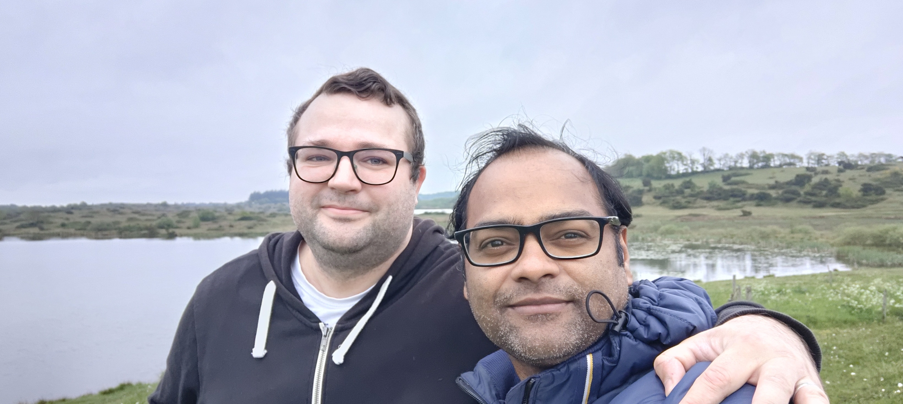

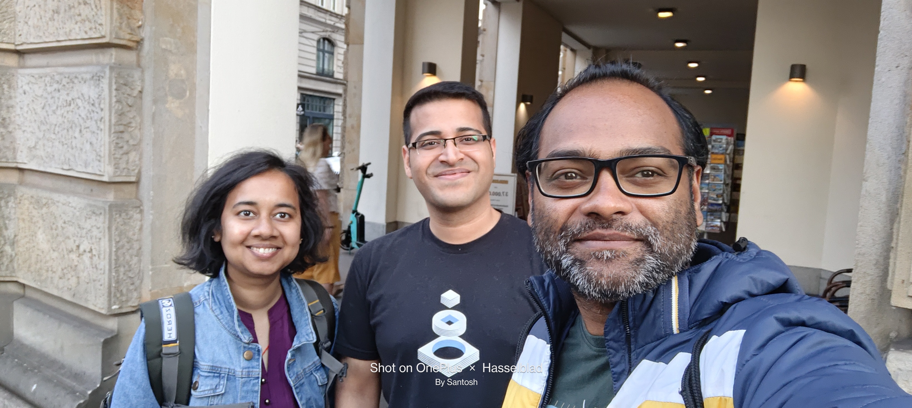

## Moving to the new house

In June, I finally got a house in a village in Germany. The home is far away from Hamburg City, but gorgeous and peaceful.

## Meeting new friends

In Hamburg, I tried to meet new people from the Indian community, but people were not so welcoming. After moving to the new place, I learned about some Indian people around my house, and I met 2 friends who are more of a family now.

Anuj and Sajith helped me with any documentation work related to my family’s Visa and my resident permit.

They invited me to their house to have dinner, and I could finally spend time with people who understood what I was going through and were ready to help.

Anuj even helped me financially, as I had to pay some money back to my employer when I left the job and was very short on cash to pay my rent the next month.

## Things changing for Good

Sometimes it’s God’s plan to send you to the right place. Moving to this new city made a few things simpler for me:

- As this a village unlike other cities where you have to wait for months to get City registration done, I got it done in a day. I dont even need an appointment.

- Got my resident permit appointment in less than 10 days.

- My family’s Visa process moved ahead and looked positive after 7 months.

- For my daughter’s school, I quickly got admission to a German Public school as there are fewer kids here in the village.

## New Job

After completing my probation, I decided to leave my job and start with [Celonis ](https://www.celonis.com/careers/jobs/)(We are hiring ), my new employer. During my interview process with Celonis, they really made me feel this is the place where I will be trusted and appreciated. The interview process felt more like a discussion and was one of my best experiences.

## Gaining confidence

After joining, I was scared and very low on confidence. I decided to talk openly with my colleague Yazan. I told him he has to keep some patience, as I am scared to write even a single line of code.

The kind of support I got from him is commendable. He was always ready to help, jump on calls to discuss, showing trust in my work.

I am a changed man after joining Celonis. My confidence is back. I can contribute more to the community and at work with more confidence.

## Family Visa

After moving to this new job, the first thing I wanted to do was travel to India. But before I could plan my travel, we got the good news, we were asked to submit the travel date and resident permit.

I received my resident permit a week after this mail. My partner and I decided I dont need to travel to India now, as we are already short on money, and they can come as soon as they get the Visa.

## The conferences months

After not so good start to 2022, till August, I had no plan to speak at conferences/meetups. I just wanted to stay away from code and community. But I realized things were changing now, my family was about to receive the Visa, and I had a job where I was making more money now, and it was a great place to work.

After joining Celonis, things started getting better.

- I got my resident permit, so I could travel outside Germany.

- My manager at Celonis was okay with me returning to India for a few weeks to see my family.

- We got a more solid response from the Embassy on the approval of Visas for my family.

## Nx Conf

After joining Celonis, I was offered an opportunity to speak at [Nx Conf](https://youtu.be/-g3NABhePJg). As it was only my first month at Celonis, I reached out to my manager Bardh to check If I could do it. Bardh was so helpful; he asked me to do it and suggested the topic.

Also, he asked me if I wanted to represent Celonis at conferences. Which I was more than happy to do.

Now I am doing some DevRel stuff for Celonis. Even though we dont really have a DevRel role, I manage my work, travel to conferences, and talk about my favorite tools, Nx and Angular.

After Joining Celonis, I traveled to the below conferences between Oct and Dec:

- Ng-DE as an attendee

- Nx Conf — Presented my talk on “Nx at Celonis”

- Firebase Summit as an attendee

- JSPolandConf — Presented my talk “Be Smart choose Nx”

- Madrid Celonis Office — Presented my talk “Be Smart choose Nx”

- NgRome — Presented my talk “Angular Router MasterClass”

- DevFest Hamburg — Presented my talk “Be Smart choose Nx”

- Angular London — Presented my talk “Be Smart choose Nx”

I took many photos with friends and met many of them for the first time. The first talk I gave at Nx Conf in Phoenix was my 14 years into Tech, my first visit to the USA, and my first in-person talk after Feb 2020.

I was honored to share the stage with many amazing folks from the community.

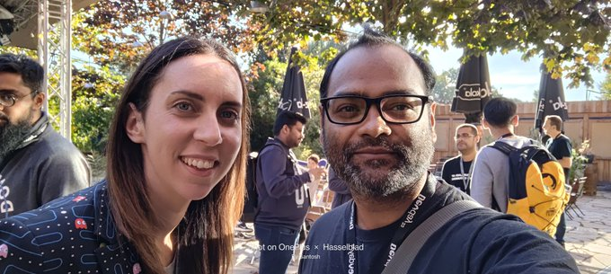
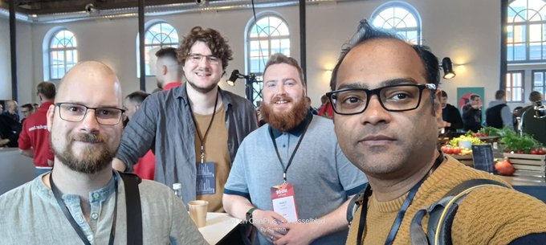

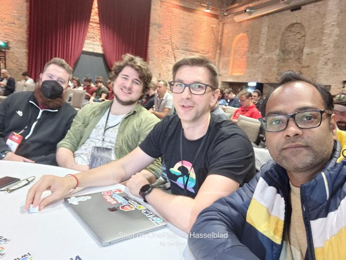

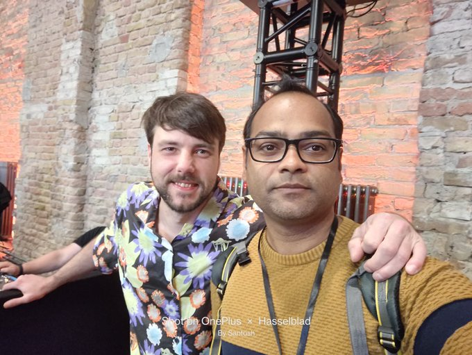

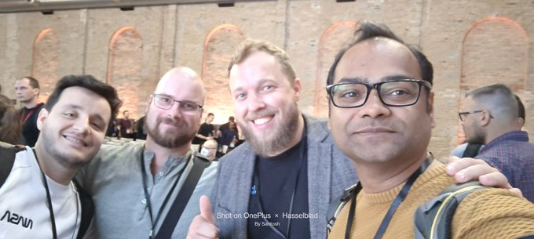

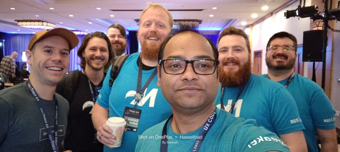

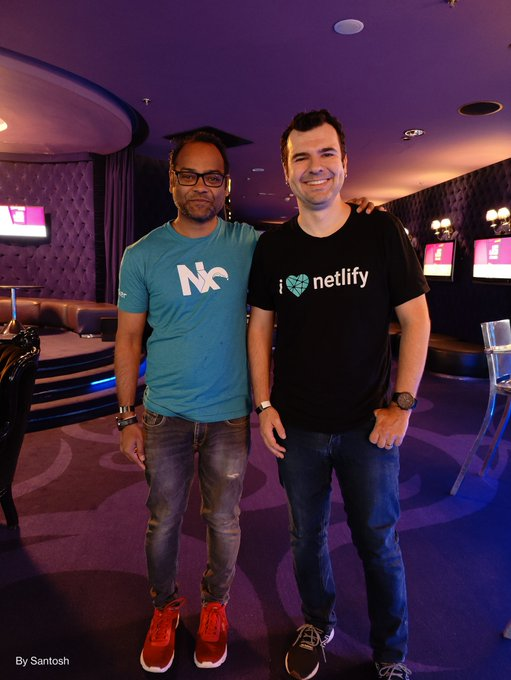

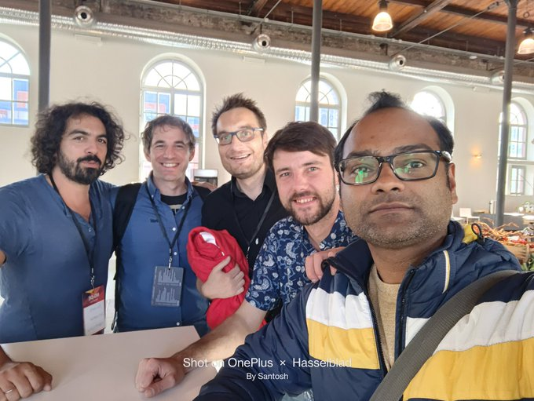

and many more....

## Angular Course Launch

I planned to release my Angular Course but kept delaying it due to burnout. Finally, after many months and after things became stable with job and family visa, I reached out to FreeCodeCamp, for my future courses, which I wanted to post on their YouTube channel. They liked my Angular Getting Started course, and we decided to collaborate.

In September, my course was published on FreeCodeCamp, and I got great feedback from the community. This was my gift to the community for helping me during my burnout.

<iframe src="https://www.youtube.com/watch?v=3qBXWUpoPHo"></iframe>

## Reunion

I booked my family flight ticket for 22nd October. I came from the US on 20th October after attending Nx Conf and Firebase summit.

I was very excited to see my family after 10 months. We were happy that we were together now.

I decided to take them for a short vacation to Berlin and Poland. I had a talk in Poland next week after they arrived.

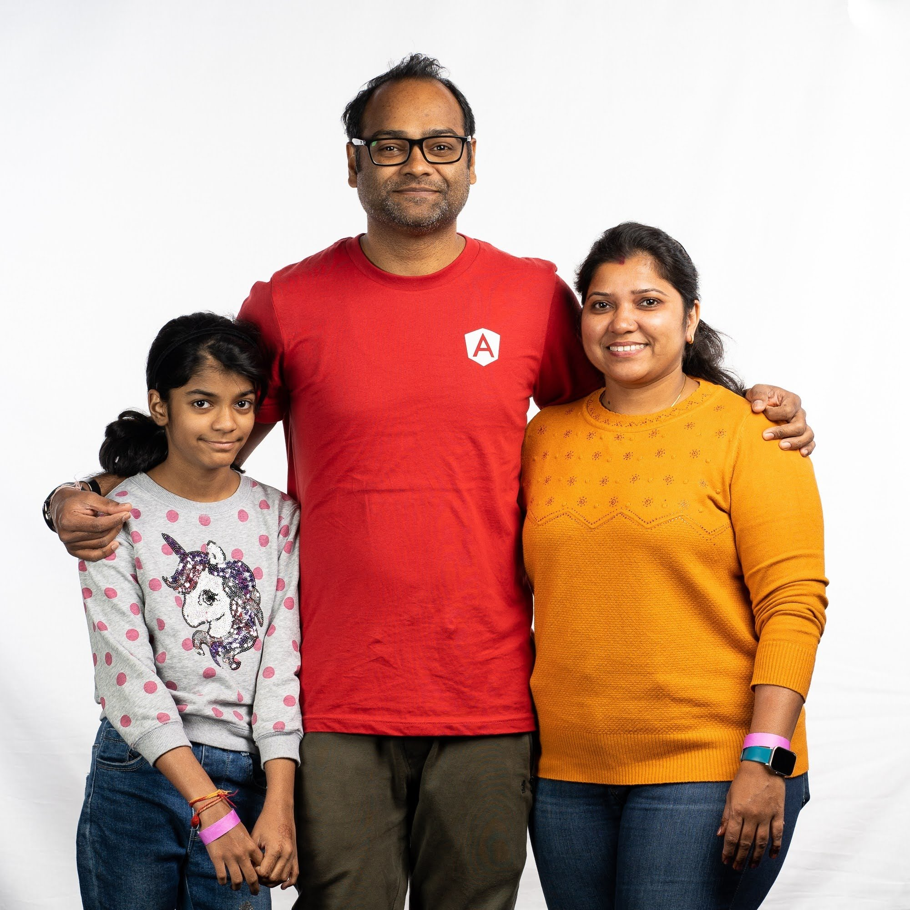

## What’s Next

Things are going good at my new job. I can follow my passion for the community, contribute to the work where I am respected, and make decisions to improve our software processes.

I am looking forward to 2023. I want to contribute more to the community. I will try to speak at many conferences next year and work on my Angular Courses, which will be free.

My main focus would be ensuring my family settles down well in Germany. We are still buying and setting up our new house, which was almost empty before they arrived.

And as I said before, **To quit is not an option.**
