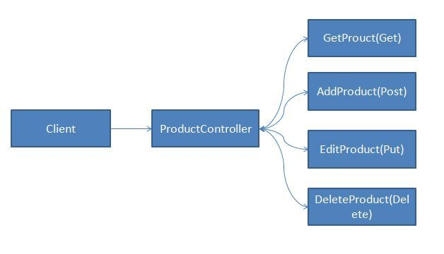
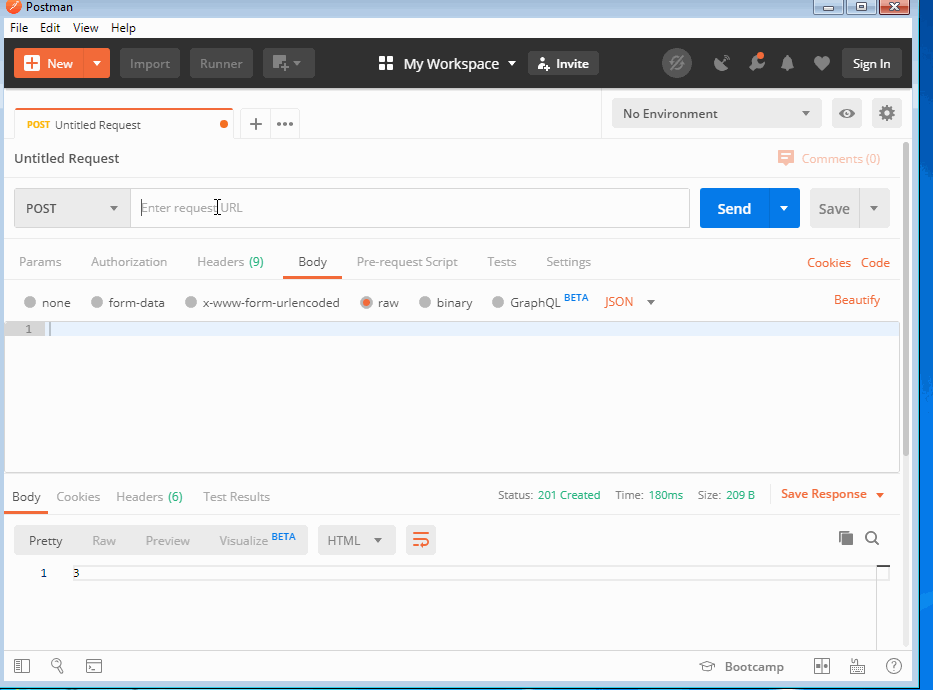

---
{
title: "NestJS Controllers Deep Dive",
published: "2020-01-06T22:19:00Z",
edited: "2021-04-06T11:08:48Z",
tags: ["javascript", "typescript", "webdev"],
description: "In this blog post, we will explore the controller which is the most important part of NestJS....",
originalLink: "https://medium.com/better-programming/nestjs-controllers-deep-dive-5c49e19d0941",
coverImage: "cover-image.png",
socialImage: "social-image.png",
collection: "4010",
order: 1
}
---

In this blog post, we will explore the controller which is the most important part of NestJS.

## Why We need Controllers

Controllers are responsible for handling requests sent to the server, controllers expose multiple endpoints on which clients can send the request. Each endpoint is identified by an Http method also known as Http Verb.

## Http Verbs

- Get: Get method is to get the data from the server, it can be a single record or multiple records. We can also pass some params which can be used for filtering the records.
- Post: Post method is used when we want to create some records in the database, We can also use post requests in cases where we want to filter some records based on some information sent to the server, for example, providing Advanced Filter.
- Put: Put method is used to update the records on the database, in Put the method we expect whatever data we are sending will be updated.
- Patch: Patch method is used when we only want to modify not replace all the values in the database.
- Delete: Delete method is used when we want to delete some records from the server.

## Http Status Code

Another thing which you have to be aware of is Http Status codes, you can refer [Mozilla docs](https://developer.mozilla.org/en-US/docs/Web/HTTP/Status) for the list of status codes. Post method returns `201` as status code in success, other methods return 200 as status code.

## Creating Our First Controller



The above image shows an `ProductController` which will take requests from client and request is handled by one of the endpoint/method defined. An Http method can receive an Http request and return Http Response in the form of JSON, XML, files or text.
To create a controller we can use Nest CLI, in our app we already have one controller available, we will create a new one called product, run the below command to create.

```shell
nest generate controller product -p default
```

`-p` flag will make sure the controller is created in the default app, otherwise, you can pass the name of the product where you want to create the controller.
Once the command is executed you will notice 2 new files.
\*product.controller.ts
\*product.controller.spec.ts (for Unit Testing)

We need to write our code in `product.controller.ts` if you open this file as of now you will find below code.

```js
import { Controller } from '@nestjs/common';
@Controller('product')
export class ProductController {}
```

- @Controller: Controller decorator is appended over the ProductController class if you are coming from .Net or Java background than you have used one while creating Web APIs. It takes one parameter where you can pass the endpoint on which request can be sent.

## Adding Our First Method

Let's add our first `Get` method which will return a list of products we will create a dummy list of products, we will see database integration in one of the upcoming articles.
Open `product.controller.ts` add below code:

```js
import { Controller, Get } from '@nestjs/common';
@Controller('product')
export class ProductController {
 products = [
    { id: 1, name: 'One Plus 7', price: 48000 },
    { id: 2, name: 'I Phone X', price: 64999 }
 ];
 @Get()
 GetProducts()
 {
   return this.products;
 }
}
```

The highlighted code is what we have added to create our `Get` method.

- @Get: Get decorator here specifies that when a client sends a request at https://endpoint/product with `Get` HTTP method `GetProducts` will be called.

Go ahead and test it start the server using the `npm run start:dev` command which will run our server in watch mode and will detect changes whenever we make any in our code, and enter `http://localhost:3000/product` in your browser, get calls can be triggered via the browser.

## Add Post method

The highlighted code is added for `Post` method and the rest of the code remains the same.

```js
import { Controller, Get, Post, Req } from '@nestjs/common';
import { Request } from 'express';
@Controller('product')
export class ProductController {
 products = [
    { id: 1, name: 'One Plus 7', price: 48000 },
    { id: 2, name: 'I Phone X', price: 64999 }
 ];
@Get()
 GetProducts()
 {
   return this.products;
 }
 
 @Post()
 AddProduct(@Req() req: Request) {
    this.products.push(req.body);
    return req.body.id;
 }
}
```

- @Post: Post decorator is to define the method AddProductwill be initiated by a client when a request is made to https://endpoint/product with Post method, Post methods cannot be initiated by using the browser we need some client I use Postman for testing. 
  &\* @Req: We can get access to Http Request object you can get access to body, headers and other request parameters.


You can see how we provide the endpoint, the method was `Post` and we sent some data in body and we received the `id` value as a response.

## Other Decorators

For Put, Patch and Delete we have @Put, @Patch and @Delete decorators available. We will see the examples for each one of them when we integrate the database.

```js
@Put()
EditProduct(){}
@Patch()
UpdateProductPrice(){}
@Delete()
DeleteProduct(){}
```

## Overriding Response and Headers

We may need to override status code or create a response data in the form of JSON, we can achieve this using `@Res()` decorator, let modify the `AddProduct` method to use it.

```js
import { Res } from '@nestjs/common';
import { Response } from 'express';
@Post()
 AddProduct(@Req() req: Request, @Res() res: Response) {
    this.products.push(req.body);
    // return json data with default status code
    return res.json({ id: req.body.id});
    // to update the status code
    //return res.status(205).json({ id: req.body.id});
}
```

If we just want to override the status code, it is possible using the @HttpCode  decorator.

```js
@Put()
@HttpCode(204)
EditProduct() {}
```

To add custom headers to the response we can use `@Header` decorator.

```js
@Put()
@Header('header-key','value')
EditProduct() {}
```

## Overriding Route Name and Creating Dynamic Route

We can provide friendly names to our routes and even make the changes to generate a dynamic URL for each request.

```js
@Put('editProduct')
EditProduct() {}
```

After making changes the endpoint will be `https://endpoint/product/editProduct`

```js
@Put('editProduct/:id')
EditProduct() {}
@Get(':id')
GetProducts() {}
```

In the above scenario, the `:id` is a dynamic value that the URL can accept. For example `https://endpoint/product/editProduct/1` where 1 is the value for `:id`

## Accessing Router Params

We can also access the params passed to a dynamic route using `@Param` decorator. In the below example, we have a new Method `GetProductById` where we are getting the products from the array by `id` parameter.

```js
@Get(':id')
GetProductById(@Param() id: number) {
    return this.products.find(p => p.id === id);
}
```

## Using Async with our Actions

There may be times, where you may want to use async actions, mostly while using `promise` or `observables`. You can achieve the same by using the below syntax.

```js
@Get()
async getProducts(): Promise<any[]> {
  return [];
}
@Get()
async getProducts(): Observable<any[]> {
  return of([]);
}
```

We will see some more example of async actions in upcoming posts.

## Registering Controllers

Controllers need to be registered with NestJS Modules, If you are using NextJS CLI this will be managed by CLI, you don't need to do it manually.

If you open `app.module.ts` you will see the below code.

```js
import { Module } from '@nestjs/common';
import { AppController } from './app.controller';
import { AppService } from './app.service';
import { ShoppingLibModule } from '@app/shopping-lib'
import { ProductController } from './product/product.controller';
@Module({
imports: [ShoppingLibModule],
controllers: [AppController, ProductController],
providers: [AppService],
})
export class AppModule { }
```

# Conclusion

In this post, we learned about Controllers and why and how to use it and learned about different decorators.
