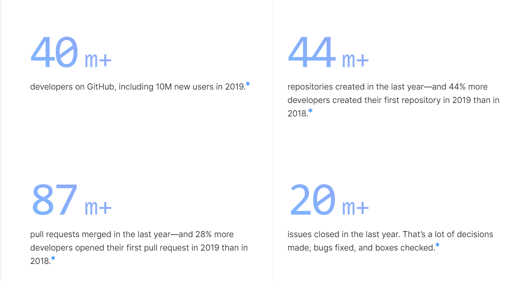

---
{
title: "Time For Employers To Change Their Perspective On Open Source Contribution",
published: "2020-02-04T08:21:34Z",
edited: "2021-04-06T11:06:47Z",
tags: ["discuss", "opensource"],
description: "Before you read this article, I want to make it very clear, I am not blaming anyone here. Keeping thi...",
originalLink: "https://medium.com/@santosh.yadav198613/time-for-employers-to-change-their-perspective-on-open-source-contribution-73d54765fddc",
coverImage: "cover-image.png",
socialImage: "social-image.png"
}
---

Before you read this article, I want to make it very clear, I am not blaming anyone here. Keeping this in mind, let’s move ahead.

# Background

I have been working in Tech Industry from last 11 years, and have seen a big change in technology, I started my career in asp.net web forms era, moved to MVC and then worked with .net Web APIs, and now working with mostly Javascript/Typescript. When I started my career in 2008, I was not even aware of what Open Source means, the only term I had heard was Java is Open Source.

I started contributing to Open Source in 2019, and believe me its fun, and you get to learn a lot while helping many developers across the world. I also received the opportunity to speak at conferences, which I really wanted to, so I can share my knowledge on a bigger stage.

# What is the problem

I was working for a big Financial Institution, and all Financial Institutions have strict rules for their employees to get involved in community-related work, which does make sense, as it may create an issue if someone shares some confidential information, which may include the code as well. Even there are developers, contributing to Open Source, who wants to be low profile in their own organization, as they are scared, they will be treated in a different way or the organization may expect something more, like providing free training's, or working for more hours, rather than investing their time contributing to OSS, and I know few people from the community, they are going through this.

# How it can be changed

Time is changing if you see the [Octoverse](https://octoverse.github.com/) data from 2019, the number of developers is increasing so do developers contributing to open source. See the below stats from 2019.

And all tech companies including Financial Institutions are using and trying to be part of this change. Many financial institutions have Open Source projects, including where I used to work and many startups have there owned Open Source products.

These are few things which Organization especially Financial Institutions should do, to adopt the change to support developers contributing or speaking at conferences:

- Training Sessions: If disclosing some confidential information is a problem, provide the training to developers, who are going to speak at the conference. They should be given training, what they can talk about, how they should present themselves.

- Better Expectations: If an organization is ready to pay 15–20k (per day rate in India), for acquiring the services from outside, to train their employees, than you should not expect your employees to do it for free.

- Support OSS: Only making some projects open source is not enough to support the community. There are organizations with billion $ in profit, using open source projects. But when it comes to supporting those projects they don’t even invest a single dollar.

- Motivate Developers: If you are a Tech lead, rather than asking them “what you get by doing OSS, or writing blog post, you even don’t get paid”, please motivate them to do it, and I have heard from many developers, their tech leads, did used these words, once they came to know about there OSS or blog posts. And the change in this culture should come from management.

- Support Community Driven Conferences: There are many conferences which happen across the world, support them my becoming sponsor, motivate your employees to attend those conferences.

When it comes to the biggest IT companies in the world, Microsoft and Google is Sponsor for almost every other conference around the globe. But the same is not true for others. You can search for any community-driven conference and try to find any other Organization from Top 10, you will see the reality.

# Conclusion

Supporting Open Source does not mean, making some projects Open Source, It includes supporting them financially, or helping them fix the issues as well. It also means the employees, who are contributing to Open Source from your organization should be treated better and given the opportunity to showcase their talent. Every organization wants the best developer to work for them, but as an employer, it is your responsibility to help your employees become best too.

What is your take, what you think needs to be changed, and how to change this attitude of employers. I feel this topic, needs discussion.
