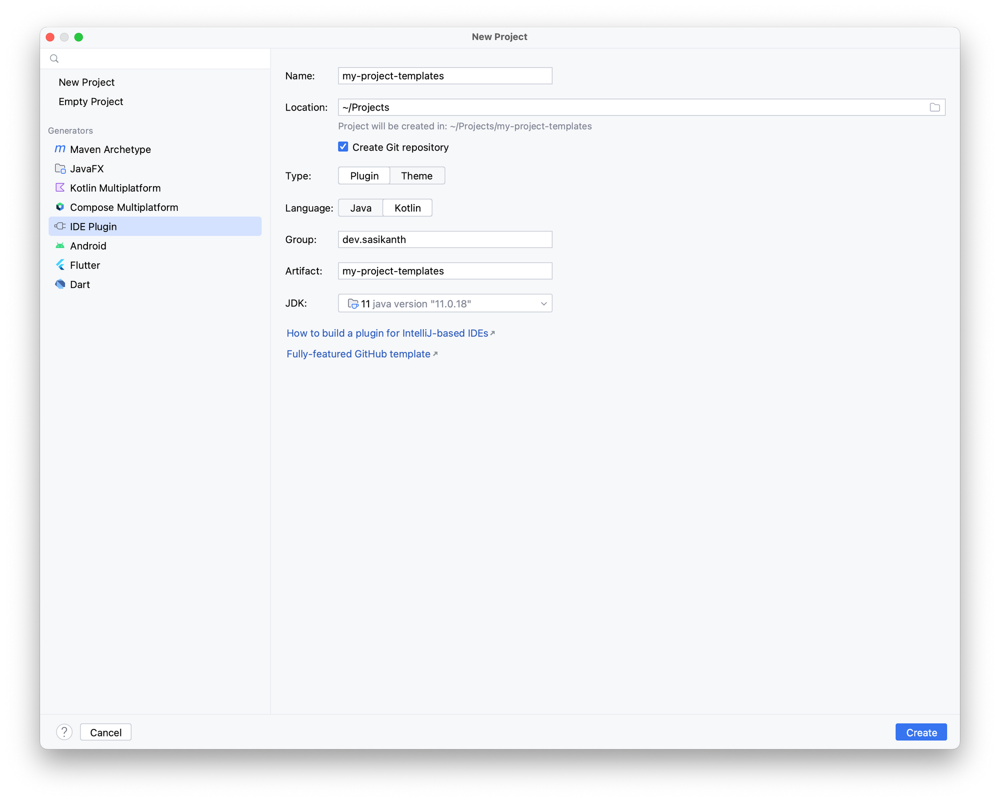
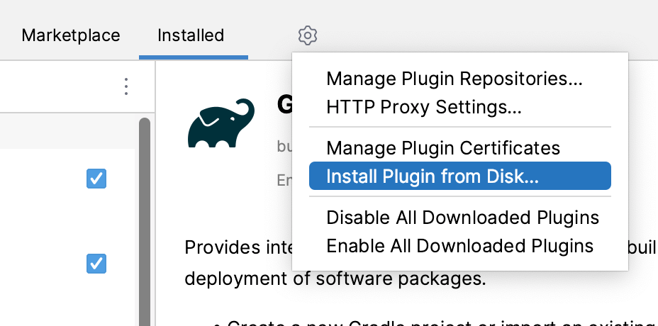
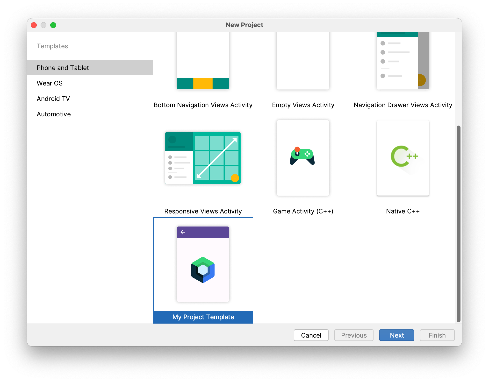
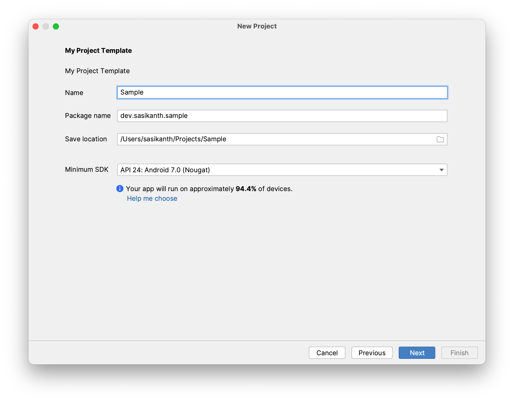
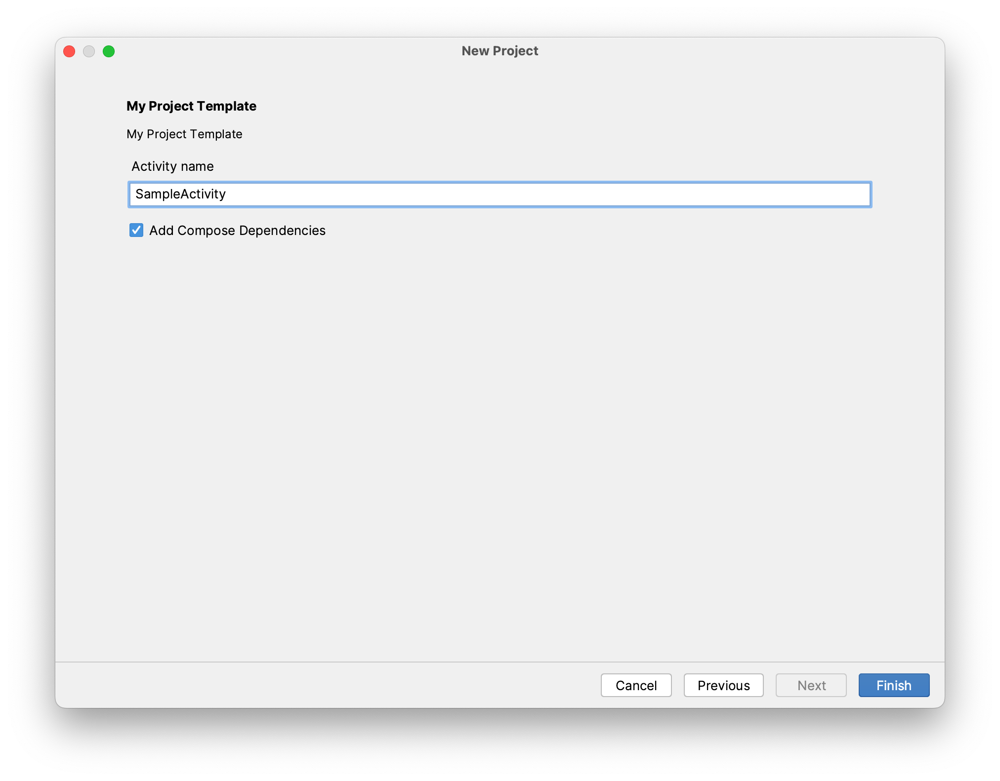

---
{
	title: "Creating project templates for Android Studio",
	description: "Showing how we can build a Android Studio plugin to provide our own project templates in the Android Studio new project wizard",
	published: "2023-02-05T14:17:00.247Z",
	edited: "2023-02-05T14:17:00.247Z",
	tags: ["android", "testing"],
	license: "cc-by-nc-sa-4",
	originalLink: "https://www.sasikanth.dev/creating-project-templates-in-android-studio/"
}
---

Recently I was looking into setting up templates for creating new projects. Obviously, a GitHub template was the first option, but I was not a huge fan of having to create a new GitHub repo from the template and then start changing things like app name, package name, application ID, removing unnecessary configurations, etc., 

Ideally, I wanted to have the option to configure things when creating a project so that I can pick and choose what I want. For example, whether or not I want to configure any CI checks, release pipeline, build configurations, etc., 

That's why I started looking into how Android Studio provides the project templates when creating a new project in the hopes of adding my own option to that new project wizard which would allow me to do those things. This post shows how you can create an IDE plugin to provide your templates in Android Studio's new project wizard.

> Note: While the following approach and APIs used in this article are public, they are not documented and hence not considered "offical" approach for creating templates.

Alright, now let's get started...

### Prerequisites

In order to create Android Studio plugins, we need to use [IntelliJ IDEA CE](https://www.jetbrains.com/idea/download) (or IntelliJ IDEA Ultimate).

Once you installed IntelliJ IDEA, create a new project to create an IDE Plugin



After the project is created, open the `build.gradle.kts` or `build.gradle` file and let's configure the Gradle IntelliJ plugin to support the Android plugin. Add the following code to the `intellij` configuration block and sync the project.

```kotlin
intellij {
  type.set("AI") // Target IDE Platform
  version.set("2022.2.1.11")

  plugins.set(listOf(
    "org.jetbrains.android"
  ))
}
```

The above code sets the plugin dependency and changes the IDE type to use Android Studio. The version we used here is Android Studio Flamingo Canary 11. You can find the Android Studio versions [here](https://plugins.jetbrains.com/docs/intellij/android-studio-releases-list.html#2022). (*Depending on the Android Studio version, the APIs you have access to in your plugin may change*)

Now open `plugin.xml` file, this is where you can configure all the information related to the plugin including things like id, name, version, depends on, etc.,

We are interested in the `depends` configuration. By default, the plugin depends on the IntelliJ platform only, but we also want to make sure the IDE has the Android plugin for our plugin to work. We can add the following two lines in the `plugin.xml`

```XML
<idea-plugin>
  <depends>org.jetbrains.android</depends>
  <depends>com.intellij.modules.androidstudio</depends>
</idea-plugin>
```

That's it, you have the project configured to build an Android Studio plugin.

### Creating project templates

In order to provide your own project templates in the new project wizard, there are a couple of things we need to configure.

- **Template**: Describes a template available in the new project wizard. Describes the template and options available for the template and which context to show it in.

- **Recipe**: Instructions for generating the project for a template. Once the user selects the template from the wizard and inputs the params, the recipe is executed with parameters supplied by the user

### Create Template

Android Studio provides a [template DSL](https://cs.android.com/android-studio/platform/tools/base/+/mirror-goog-studio-main:wizard/template-plugin/src/com/android/tools/idea/wizard/template/TemplateDSL.kt;l=42;drc=ba204c8fd9bebbaf8a10c40aab7ce6ec74ba59fa) to create these templates. You can also take a look at [existing templates](https://cs.android.com/android-studio/platform/tools/base/+/mirror-goog-studio-main:wizard/template-impl/src/com/android/tools/idea/wizard/template/impl/activities/) to build your own templates. 

So, let's create one. Create a new file called `ProjectTemplate.kt`, and add a new variable to provide the template.

```Kotlin
import com.android.tools.idea.wizard.template.Category
import com.android.tools.idea.wizard.template.CheckBoxWidget
import com.android.tools.idea.wizard.template.FormFactor
import com.android.tools.idea.wizard.template.ModuleTemplateData
import com.android.tools.idea.wizard.template.PackageNameWidget
import com.android.tools.idea.wizard.template.TemplateConstraint
import com.android.tools.idea.wizard.template.TemplateData
import com.android.tools.idea.wizard.template.TextFieldWidget
import com.android.tools.idea.wizard.template.WizardUiContext
import com.android.tools.idea.wizard.template.booleanParameter
import com.android.tools.idea.wizard.template.impl.defaultPackageNameParameter
import com.android.tools.idea.wizard.template.stringParameter
import com.android.tools.idea.wizard.template.template
import java.io.File

val projectTemplate
  get() = template {
    name = "My Project Template"
    description = "My Project Template"
    minApi = 21
    constraints = listOf(
      TemplateConstraint.AndroidX,
      TemplateConstraint.Kotlin
    )
    category = Category.Application
    formFactor = FormFactor.Mobile
    screens = listOf(WizardUiContext.NewProject, WizardUiContext.NewProjectExtraDetail)

    val activityName = stringParameter { 
      name = "Activity name"
      default = "MainActivity"
    }
    
    val addComposeDependencies = booleanParameter {
      name = "Add Compose Dependencies"
      default = false
    }

    val packageName = defaultPackageNameParameter

    widgets(
      TextFieldWidget(activityName),
      CheckBoxWidget(addComposeDependencies),
      PackageNameWidget(packageName)
    )

    // I am reusing the thumbnail provided by Android Studio, but
    // replace it with your own
    thumb { File("compose-activity-material3").resolve("template_compose_empty_activity_material3.png") }

    recipe = { data: TemplateData ->
      projectRecipe(
        moduleData = data as ModuleTemplateData,
        packageName = packageName.value,
        activityName = activityName.value,
        canAddComposeDependencies = addComposeDependencies.value
      )
    }
  }
```

- **Name**: Name of the project template
- **Description**: Description of the template
- **MinApi**: Minimum SDK version required to build this template
- **Constraints**: Conditions under which the template should be rendered in the new project wizard. For example, we don't want to show this template if AndroidX or Kotlin support is not available or enabled in the IDE
- **Category**: Determines which menu entry the template belongs to. For example, Application, Activity, Compose, Service, etc.,
- **FormFactory**: Determines which form factor the template belongs to. Templates with particular form factors can only be rendered in the corresponding category. For example, when you're creating a new project you have the categories for templates like phone and tables, wear os, etc.,
- **Screens**: UI Context in which the template should be displayed. Should include all possible contexts. For example, we defined a context of `NewProject` and `NewProjectExtraDetail` in the above template. This means this template is only shown as an option when we are creating a new project. You can also add `NewModule` or `MenuEntry` and [others](https://cs.android.com/android-studio/platform/tools/base/+/mirror-goog-studio-main:wizard/template-plugin/src/com/android/tools/idea/wizard/template/Template.kt;l=9;drc=09e6e43591ea9d05dc89f0434b2c44cff862887e). (Note: `NewProjectExtraDetail` will show an extra page after the initial configuration to allow for more customization)
- **Widgets**: Collecting of `Widget`s to render in `NewProjectExtraDetail` context. For example, this will be useful in case you wanna provide more config options after the default initial new project wizard page.
- **Thumb**: Thumbnail for the template to show in the new project wizard
- **Recipe**: The recipe used to generate the template output. It will be called after the user provides values for all the configuration parameters. 

### Create Recipe

Now let's create our recipe for generating the project. Create a file called `ProjectRecipe.kt` and an extension function for  `RecipeExecutor` called `projectRecipe`

```Kotlin
import com.android.tools.idea.wizard.template.ModuleTemplateData
import com.android.tools.idea.wizard.template.PackageName
import com.android.tools.idea.wizard.template.RecipeExecutor

fun RecipeExecutor.projectRecipe(
  moduleData: ModuleTemplateData,
  packageName: PackageName,
  activityName: String,
  canAddComposeDependencies: Boolean
) {
  
}
```

Basically `RecipeExecutor` is an execution engine for the instructions we provide in the recipe. So, let's provide some instructions to generate a project.

For this example let's keep it simple and create a project with empty activity and the ability to toggle whether or not we want to add Compose dependencies to it. 

`RecipeExecutor` provides functions to do some common actions like adding dependencies, plugins, build features, etc., Let's use the `addDependency` function to add the required Compose dependencies. 

```Kotlin
private const val COMPOSE_BOM_VERSION = "2022.10.00"
private const val COMPOSE_KOTLIN_COMPILER_VERSION = "1.3.2"

fun RecipeExecutor.projectRecipe(
  moduleData: ModuleTemplateData,
  packageName: PackageName,
  activityName: String,
  canAddComposeDependencies: Boolean
) {
  addAllKotlinDependencies(moduleData)
  addMaterial3Dependency()
  
  if (canAddComposeDependencies) {
    addDependency(mavenCoordinate = "androidx.activity:activity-compose:1.5.1")

    // Add Compose dependencies, using the BOM to set versions
    addPlatformDependency(mavenCoordinate = "androidx.compose:compose-bom:$COMPOSE_BOM_VERSION")
    addPlatformDependency(mavenCoordinate = "androidx.compose:compose-bom:$COMPOSE_BOM_VERSION", "androidTestImplementation")

    addDependency(mavenCoordinate = "androidx.compose.ui:ui")
    addDependency(mavenCoordinate = "androidx.compose.ui:ui-graphics")
    addDependency(mavenCoordinate = "androidx.compose.ui:ui-tooling", configuration = "debugImplementation")
    addDependency(mavenCoordinate = "androidx.compose.ui:ui-tooling-preview")
    addDependency(mavenCoordinate = "androidx.compose.ui:ui-test-manifest", configuration="debugImplementation")
    addDependency(mavenCoordinate = "androidx.compose.ui:ui-test-junit4", configuration="androidTestImplementation")
    addDependency(mavenCoordinate = "androidx.compose.material3:material3")

    requireJavaVersion("1.8", true)
    setBuildFeature("compose", true)
    // Note: kotlinCompilerVersion default is declared in TaskManager.COMPOSE_KOTLIN_COMPILER_VERSION
    setComposeOptions(kotlinCompilerExtensionVersion = COMPOSE_KOTLIN_COMPILER_VERSION)
  }
}
```

Now that we configured our build file, let's create our empty activity. Android Studio templates use string templates to create the files. So, let's create an empty activity string template in `EmptyActivity.kt` file.

```Kotlin
import com.android.tools.idea.wizard.template.escapeKotlinIdentifier

fun emptyActivity(
  packageName: String,
  activityClass: String
) = """
package ${escapeKotlinIdentifier(packageName)}

import androidx.appcompat.app.AppCompatActivity
import android.os.Bundle

class $activityClass : AppCompatActivity() {
    override fun onCreate(savedInstanceState: Bundle?) {
        super.onCreate(savedInstanceState)
    }
}

"""
```

Finally, let's create the activity and save it in the recipe

```Kotlin
fun RecipeExecutor.projectRecipe(
  moduleData: ModuleTemplateData,
  packageName: PackageName,
  activityName: String,
  canAddComposeDependencies: Boolean
) {
  // ...configuring dependencies
  
  val emptyActivity = emptyActivity(packageName, activityName)
  val emptyActivityPath = moduleData.srcDir.resolve("$activityName.kt")
  save(emptyActivity, emptyActivityPath)
  open(emptyActivityPath)
}
```

That's it you have created your first project template for Android Studio. While I only showcased adding dependencies and a Kotlin file. You can pretty much add any file type as they just rely on a string template. For example, you can create scripts or GH Actions or editor config, etc.,

If you tried to run/build the plugin now and test it in Android Studio you won't see the template show up just yet. There is one final step to provide this template to Android Studio.

### Providing the templates to Android Studio

Android Studio provides templates to the new project wizard using something called a `WizardTemplateProvider` . It's an interface that implements a function to return a list of `Template`s.  

The `WizardTemplateProvider` itself is exposed as a plugin extension, which means we can provide our own template provider to add to the already existing template provides. (*Android Studio provides its own templates using a [`WizardTemplateProviderImpl`](https://cs.android.com/android-studio/platform/tools/base/+/mirror-goog-studio-main:wizard/template-impl/src/com/android/tools/idea/wizard/template/impl/WizardTemplateProviderImpl.kt;l=73;drc=4fda3e023d777cc46b47b54a812ea297bce4e991) class*)

First, let's implement a class called `MyProjectTemplateProvider` which extends `WizardTemplateProvider`. 

```Kotlin
import com.android.tools.idea.wizard.template.Template
import com.android.tools.idea.wizard.template.WizardTemplateProvider

class MyProjectTemplatesProvider : WizardTemplateProvider() {

  override fun getTemplates(): List<Template> {
    return listOf(projectTemplate)
  }
}
```

Now, open the `plugin.xml` file and add a new extension to set our `wizardTemplateProvider`

```XML
<extensions defaultExtensionNs="com.android.tools.idea.wizard.template">
  <wizardTemplateProvider implementation="dev.sasikanth.myprojecttemplates.MyProjectTemplatesProvider"/>
</extensions>
```

That's it, now any [`Template`](https://cs.android.com/android-studio/platform/tools/base/+/mirror-goog-studio-main:wizard/template-plugin/src/com/android/tools/idea/wizard/template/Template.kt;l=72;drc=09e6e43591ea9d05dc89f0434b2c44cff862887e) you provide in `MyProjectTemplatesProvider` will be visible in the new project wizard after you install your plugin in Android Studio. 

You can verify that the plugin and template are working as expected by running `./gradlew runIde`.

### Installing the plugin

Run the `./gradle buildPlugin` command to generate the plugin jar. It should generate in our `build/libs` folder in the project. 

Now open Android Studio and go to the plugins section and click on the gear icon to select install from disk option



Select the jar file you just created and restart the Android Studio. 

Now when you create a new project, you should see your project template.





You can provide multiple project templates with this approach and configure the items when creating the project. You can find the sample used in this article [here](https://github.com/msasikanth/my-project-templates)
