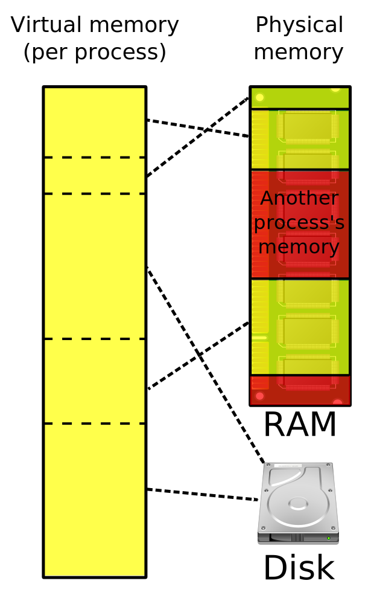

---
{
    title: 'Virtual Memory Overview',
    description: 'An overview of how operating systems give processes their own address space.',
    published: '2020-05-19T12:45:00.000Z',
    tags: ['computer science', 'cpp'],
    license: 'cc-by-nc-nd-4'
}
---

Memory in your standard computer works in a much more abstract and complex way then you would initially expect. I'm writing this from the point of someone developing software and less about someone understanding each part of the hardware.

# Virtual Memory {#virtual-memory}

Operating systems (OS) are the ones in control of all of the physical memory in your computer. This is a safeguard to make sure that memory is being allocated fairly to all processes. The way this is done is by a concept called **Virtual Memory**. As the name suggests, it means that it's shrouding the physical memory in hardware with seemingly infinite storage (in reality, you're limited by various elements of your hardware, but the amount of memory you can assign to virtual memory is typically orders of magnitude higher than the amount you can store in physical memory) for each process that is created. This is accomplished by using more than just your main memory in the case that if you need more storage, then the OS can also store it on your hard drive or SSD. Even though it may seem like a slower alternative, it allows much more freedom for processes without wrecking your computer.



Virtual Memory uses what are called **page tables** that point to a memory map which will then finally point to either your physical memory or something like an HDD. It works like a cache where each entry in a page table is only used when absolutely necessary. Whenever a process comes in it only stores the "pages" that the OS thinks the process will need in main memory while the rest stay behind. This reduces the amount of memory that is taken up as well as speeding up the overall time it would take to complete a process.

## What Virtual Memory looks like in C/C++ {#virtual-memory-cpp}

In C/C++ your virtual memory is broken up into ~4 basic "blocks" for where different aspects of your code are stored. The four memory areas are Code, Static/Global contexts, Stack, and Heap. The code section as you can probably guess is where your local code is held, it's specifically for the syntax of the area of the code that is being read. The Static/Global contexts are also as expected, either your global variables or your static methods that are set. The last two are the more complex areas and the two that you will want to have the most understanding in if you are working with a language that doesn't have garbage collection.

- Heap
- Stack
- Static/Global
- Code

# The Stack {#stack}

The stack is where all of your local variables from the inner contexts are stored. The more local the variable the higher they are on the stack to eventually be popped off. The stack data structure is the same one that is used in memory, and it works by placing objects in by **LIFO**(Last in First out). Just like a stack of papers, you can see the paper on top of the stack but none of the others. You also can't reach inside of the stack, you have to remove the papers on top to see the papers below.

```cpp
// Stack variable definition
int num = 12;
```

# The Heap {#heap}

The heap is where you store objects that seem to be global in nature. In C/C++ when you're swapping between methods and you want an object that you are returning to go outside of the local context of the method, you use the **new** or **malloc()** keywords. The heap is another data structure that works like a binary tree held in a normal array or list. This shows that there is a hierarchical difference compared to the stack.

```cpp
// Heap Object definition
Item bat = new Item();
```

The heap is where you have to be the most careful because even after termination of the program, whatever you placed on the heap will still be there. This is what creates memory leaks, it's a good rule to know that whenever you call the **new** or **malloc()** keywords, you need an equal number of **delete** or **free()** keywords present.

You will most likely use the heap when you want to create something with a higher scope, or if you want to access it dynamically. That means that your spot on the stack is a set size, but when you create something on the heap it can be any size that you want. The downside is that C uses [pointers](/posts/pointers-and-references-cpp) that sit on the stack in order to access the heap so it will end up being much slower.

## Putting it together

```cpp
#include <vector>
#include <iostream>

using namespace std;

// Creating a new global vector
vector<int> *vec;

// Example method that fills a new vector of size "length" with zeros
void example1(int length) {
	vec = new vector<int>(length, 0);
}

// Example method that creates a stack variable
void example2(int length) {
	vector<int> retVal(length, 1);
	*vec = retVal;
}

// main method for testing
int main() {
	// Memory address of the heap that is stores on the stack
	cout << vec << endl;

	// Define vec by calling example1
	example1(10);

	cout << vec << endl;

	for (int val : *vec) {
		cout << val << ", ";
	}

	cout << endl;

	// Redefine vec by calling example2
	example2(10);
	
	cout << vec << endl;
	for (int val : *vec) {
		cout << val << ", ";
	}
	delete vec;
}
```

Just so we understand what is going on here, I created a global vector pointer that I did not define. Therefore it is just on the stack represented as a '0'. When **example1()** is called it allocates memory for vec on the heap and instantiates a vector with all zeros. You can access the vector using the memory address on the stack. When I print out just "vec" it will print out the memory address of the location on the heap where it is stored, when I call *vec it then goes to that memory location on the heap. **[To learn more about pointers, read this article](/posts/pointers-and-references-cpp)**.

The other method, **example2()**, just creates a new local vector and sets vec equal to it. You'll see why this is problematic later on. When the program is run in the order **example1()** -> **example2()** everything will work fine. And here is the output:

```
0

0x80004ae10

0, 0, 0, 0, 0, 0, 0, 0, 0, 0,

0x80004ae10

1, 1, 1, 1, 1, 1, 1, 1, 1, 1,
```

**But**, when you call it in the other order, calling **example2()** first, this is what happens...

```
0
```

What happens is you get a segfault. This segfault occurs because you're trying to assign a value to a pointer when that pointer isn't pointing anywhere. You're trying to access memory that doesn't exist.

# Review/Conclusion {#conclusion}

Operating systems protect physical memory by giving each process a seemingly infinite amount of virtual memory where they each have their own address space that doesn't affect any other processes. Understanding this and how the virtual memory is represented is a fundamental building block in becoming a better and more efficient programmer.

Unclear about something regarding virtual memory? Maybe you'd like to expand on some of the subjects touched on here? Be sure to join us [in our Discord Server](https://discord.gg/FMcvc6T) and ask away! We like to chat, hang out, and enjoy talking CS-related subjects!
