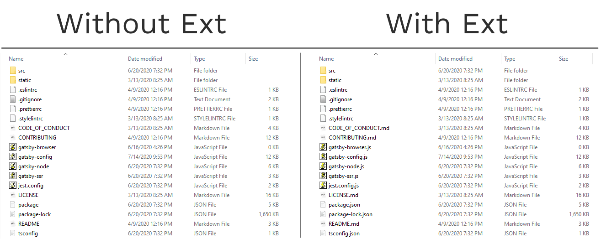

---
{
	title: "What do file extensions do?",
	description: "A file extension isn't the only way a file is identified, so what does it do?",
	published: "2020-07-11T20:58:16.292Z",
	edited: "2020-07-11T20:58:16.292Z",
	tags: ["computer science"],
	license: "cc-by-nc-sa-4"
}
---

> A filename extension or file type is an identifier specified as a suffix to the name of  computer file. - [Wikipedia](https://en.wikipedia.org/wiki/Filename_extension)

A long & terse explanation of a file extension exists but to boil it down into simpler terms the file extension is used by a computer to check against a registry of programs to see if a program is registered on the system that can open the file. While there are some differences based on how they are treated by the operating system you use, in most cases, they are used as a simple check to allow a system to see what program can open the file.

# Viewing the File Extension

When most people look at a file they probably don't see a file extension after the name. Often, by default, the file extension is hidden from the user. You can easily find articles that outline how to [turn file extensions on for macOS](https://support.apple.com/guide/mac-help/show-or-hide-filename-extensions-on-mac-mchlp2304/mac) or [how to turn it on for Windows](https://www.howtogeek.com/205086/beginner-how-to-make-windows-show-file-extensions/). Now when looking at the file its extension will be visible right after the name.

As an example, most pictures you have will end in `.jpg`, `.png`, `.gif`, `.webp`, or `.avif`. A program will have a `.exe`, `.bash`, or `.bat`. A music file might have a `.mp3`, `.mp4`, `.flac`, or `.ogg`. A text file can be `.docx`, `.txt`, or `.odf`. Then there are spreadsheets, videos, hardware drivers, databases, and many other types of file extensions with more being made every day.

Keep in mind, these file extensions are just part of the file name, they aren't part of your file's contents. If you were to remove or change the file extension and then add it back, nothing bad would happen to your file and it would act the same as it did before.

# Opening the File

Whenever you open a file, whether it's through a double click or open a file in an operating system from a menu the computer will go and see if there is a program registered to open that type of file extension. If it can find one registered to open the file, it takes the file and sends it to the program. If it can't find one then the computer will ask you to choose one of the programs on your computer that are registered to be associated with the file type to be used to open those types of files from now on. Of course, you could also tell your computer to change the program used to open the file menu and telling it to "open with" for a different program or by editing the file association table manually to register the program for the future. Then the program starts up then it opens the file and then the program can show the file in the way it is supposed to.

# What happens if you open a file with another program

> This is a serious warning about the following information: You can make your files unrecoverable if you change the file extension or open a file with another program it is not designed to be opened with. This can lead to a permanent loss of data. The following is only an example and should not be taken as an endorsement to try this on your system. DO NOT TRY THIS AT HOME WITHOUT TAKING PROPER PRECAUTIONS!

A file on a computer is stored the same way as everything on a computer is: in a binary representation. Any program works with binary, and thus you could forcibly open a file with another program either by manually making the program open the file or by changing the file's extension. See the warning above. This can ruin the file depending on the program used to open it and should only be done if you know what you're doing and must do this. Sometimes though a file will open just fine. This can commonly be seen with Text files and Image files. Often when you change the file extension and open it in an appropriate program it will open just fine. Sometimes it won't, but that is due to the program and not the file. The file opens just fine because the very beginning of the binary representation is a set of [Magic Bytes](https://en.wikipedia.org/wiki/File_format#Magic_number) that identify the type of file beyond just the file extension. This identifying information is then used by the program to match the instruction set to operate the type of file. Not all programs operate this way though. Some of them only rely on opening known good files, and if used to open a file will just start operating on it right away. This is often how a program destroys a file because it was designed to work on specific types of files and because that program is single-use it is never designed to safely use other file types so it doesn't check for them and relies purely on the operating system to call the program. Although rare, these programs do exist. More often than not though the two systems are used together. If you don't change the extension or open a program with an unexpected program this is a rare occurrence.

# A basic understanding

Now armed with knowledge about what a file extension is, how it helps a computer, and a little about the backup mechanisms meant to aid this series of systems it probably makes more sense why there are different programs for different types of files.
