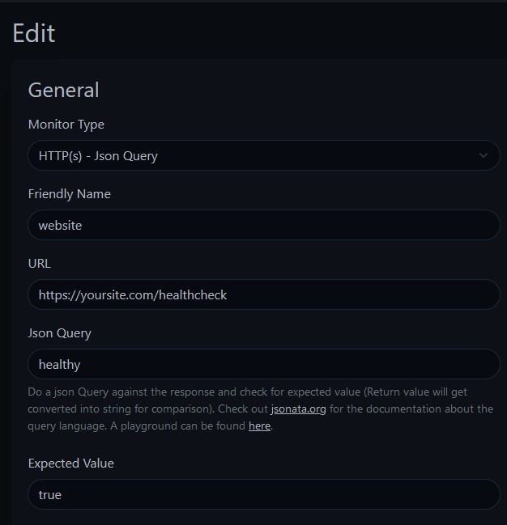

---
{
	title: "Astro Healthcheck",
	description: "Monitoring Your Blog for Issues",
	published: '2023-12-29T13:45:00.284Z',
	tags: ['astro', 'webdev', 'javascript'],
	license: 'cc-by-nc-sa-4'
}
---

Recently, I found myself caught in a maze of DevOps challenges that resulted in unexpected outages for my blog. Each time I thought I had fixed the issue and moved on, I'd soon discover that the site was down again. Frustration led me to implement a simple yet effective solution—a "healthcheck" endpoint.

```js
/* ssr server or hybrid required */
export const prerender = false;

/**
 * @param {import('astro').APIContext} context
 * @returns {Response}
 */
export function GET(context) {
  return new Response(JSON.stringify({ healthy: true }), {
    status: 200,
    headers: {
      "Content-Type": "application/json",
    },
  });
}
```

For an Astro site, implementing this is surprisingly straightforward. By opting for a Server-Side Rendering (SSR) page and returning a response with a success status along with a JSON object containing the value "healthy: true," you can quickly gauge the health of your site.

> note: this requires the astro output to be server or hybrid

Now, you might wonder, "Why bother with SSR in an Astro, which is primarily a Static Site Generator (SSG)? Wouldn't it be simpler to use a static JSON file?" The answer lies in the assurance that opting into SSR provides. It allows our healthcheck endpoint to confirm the responsiveness of the Node.js code.

Once your healthcheck endpoint is up and running, the next step is monitoring. Utilize an uptime service like Uptime Kuma to keep a vigilant eye on your blog's status. Here’s a glimpse of an Uptime Kuma configuration:



From this point, you can configure notifications for yourself, be it through email, Discord, or any other preferred channel, ensuring prompt awareness in case your blog experiences downtime.

To streamline this process, consider adding the Astro integration by executing:

```bash
npx astro add @besomwebcraft/astro-healthcheck
```

With this integration, the healthcheck endpoint becomes seamlessly hosted, enhancing the overall convenience of monitoring your blog's health.

Ensuring your blog's availability and performance has never been easier. Implementing these steps not only prevents unexpected downtime but also provides you with the peace of mind that your Astro site is running smoothly.
