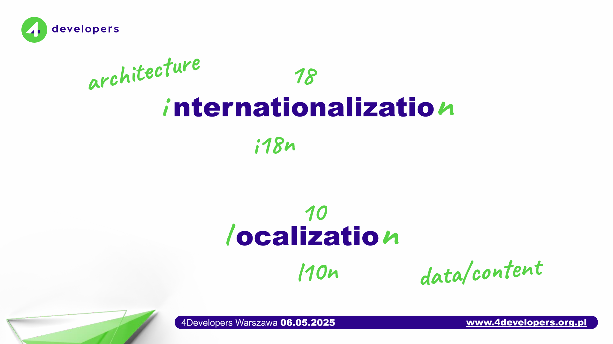
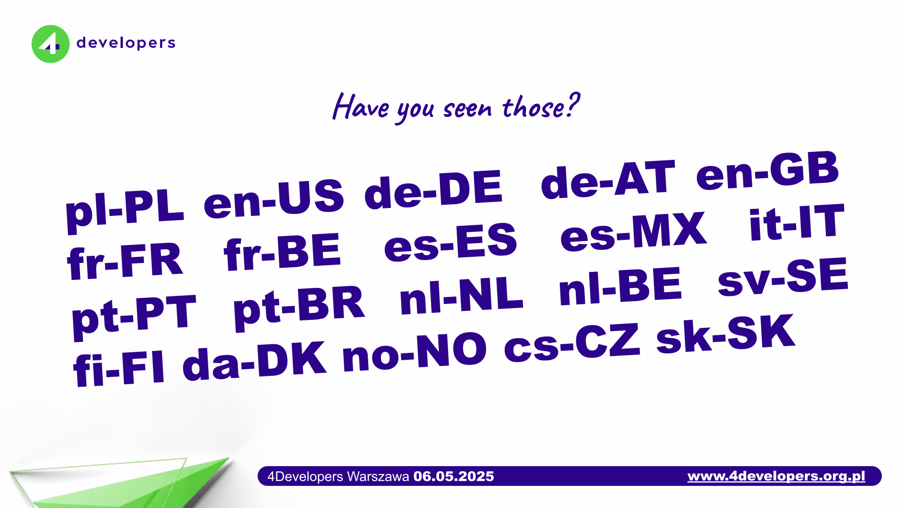
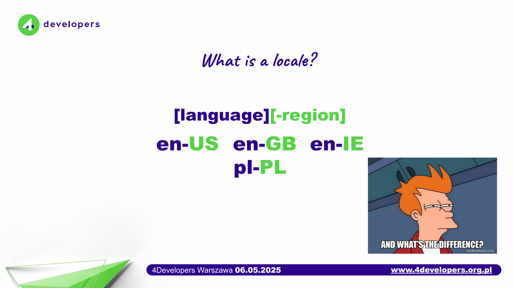

---
{
	title: "Building for the World: A Developer's Guide to Internationalization and Localization",
	description: "Practical introduction to internationalization (i18n) and localization (l10n) - from a developer's point of view.",
	authors: ["szymonchudy"],
	tags: ["javascript", "css", "webdev"],
	originalLink: "https://szymonchudy.com/blog/building-for-the-world-developers-guide-to-i18n-and-l10n",
    published: "2025-12-19T13:45:00.284Z",
    license: 'cc-by-nc-nd-4'
}
---

## Preface

In today's interconnected world, building software isn't just about writing great code - it's about creating experiences that resonate with users across different languages and cultures.

When we develop applications with internationalization (i18n) and localization (l10n) in mind, we open doors to global audiences, creating products that feel native to each user, regardless of their location or language.

This practical guide will walk you through the essentials of i18n and l10n from a developer's perspective, showing you how to build truly global applications that can reach users worldwide. Let's start with the basics.

This article is based on a presentation we gave at the [4developers](https://4developers.org.pl) conference, alongside [Igor Savin](https://www.linkedin.com/in/igor-savin-5505099/) - my colleague and principal engineer at [Lokalise](https://lokalise.com).


## What are those fancy acronyms?

In software engineering, we often use acronyms like i18n, l10n, or even a11y. While we know what they mean, have you ever wondered about their origins?

If you're unaware of the "algorithm" behind them, you'll be surprised by how simple and obvious it is. At least, I was when I discovered it.

Since typing or saying _internationalization_ repeatedly throughout the day can quickly become tedious, developers needed a shorter way to refer to these lengthy terms in their code and documentation. So they did what we would expect - developed an algorithm that keeps the first and last letters, counting the letters in between.

For **_internationalization_**, they kept the first letter "i" and the last letter "n", and counted the 18 letters in between - hence **_i18n_**.

They applied the same logic to **_localization_**: the first "l", the last "n", and the 10 letters in between became **_l10n_**.

As you might expect, **_accessibility_** followed the same pattern, becoming **_a11y_**.



This naming convention became so widely adopted that it's now standard in the software industry, making it easier for developers worldwide to communicate these concepts without typing lengthy words repeatedly.

Throughout this article, I will use both the full words and their acronyms interchangeably.

## i18n and l10n - What's The Difference?

Let's think of building software like constructing a house that will be lived in by people from different countries.

### Internationalization (i18n)

Internationalization is like designing and building the house with a flexible foundation - plumbing, wiring, and spaces that can accommodate different needs. For example, there are different electricity sockets for the US, UK, and EU. You can use the same wiring (i18n), but the final "UX" varies slightly.

In software terms, it means developing your application in a way that it can be **easily adapted to various languages and regions** without requiring a complete overhaul.

You neutralize and abstract things like text, date formats, and layouts from the core code.

> i18n is the groundwork that makes adding new languages possible.

### Localization (l10n)

Localization adds the final touch to align a house with the specific character/requirements of a given country. As mentioned earlier, this includes features like electricity sockets. For instance, in many British homes, particularly older ones, you may still find two separate taps—one for cold water and one for hot. While the pipes within the walls are the same, the final touches vary according to the intended result.

Moreover, it doesn't have to touch the infrastructure only. Maybe your country has some characteristic furniture that is easy to find in an average home, or perhaps some color is more popular for use on interior walls (e.g., beige was very popular in Poland in the 90s).

> Localization is about giving your app that native vibe.

In software, localization is the process of **adapting your product to a particular locale**: translating the text into Spanish or Chinese, formatting dates and numbers according to regional settings, and tweaking visuals or content to fit cultural nuances. It's all about the details that make users feel _"this app was made for me."_

### Real-world example

Suppose we have a US-based e-commerce website.

Internationalization is when we ensure all the UI strings are externalized (not hard-coded in English), the layout can handle longer text, and we use a library to format numbers based on locale. Our fonts should also support diacritical symbols for different languages and dialects.

Localization is when we actually provide the French (`fr-FR`) translations for those strings, use the euro symbol € for currency and `DD/MM/YYYY` date format for European users. Maybe we should swap an American football icon for a soccer ball icon in Europe as well.

The two go hand-in-hand - i18n is the preparation, l10n is the execution.


## Why Should Developers Care About Locales and Culture?

We developers love solving problems, and making an app work globally is a big puzzle with big payoff. Here's why considering locale differences early on is worth the effort:

### Reach and User Experience

Not everyone understands your app's default language.

By supporting multiple languages, you welcome a bigger audience. Users also notice when your app speaks their language and follows their local conventions - it feels more _natural_. For example, displaying prices as **€9,99** for someone in Germany (instead of **$9.99**) or formatting dates as **31/05/2025** instead of **05/31/2025** for a user in Poland can prevent confusion and build trust.

### Cultural Nuance

Language is more than words. It carries culture.

Idioms, tone, and even color choices can impact how your app is perceived. A joke that lands well in one culture might fall flat (or offend) in another. Considering localization means being mindful of these nuances.

Something as simple as the word "Hello" translates differently (formal vs informal) across languages - in Spanish, "Hola" vs "Buenos días" depending on context.

Good i18n/l10n ensures you get these details right in each locale.

### Avoiding Hilarious (or Horrible) Mistakes

Without localization, developers often resort to quick hacks that can go wrong.

Ever seen **�** characters or garbled text in an app? That's often a Unicode/encoding issue from not handling other scripts properly. Or consider the infamous example of a social media app that hard-coded "Yesterday" for timestamps - it confused users when the word didn't translate, leading to "Yesterday" showing up on French and Japanese timelines.

By preparing our apps for localization, we dodge these gotchas. Some mistakes can be quite funny (like an automated translation that turned "Homepage" into "Homeland" in one locale), but others can frustrate users. Better to get ahead of it!

> Nothing breaks users' trust like mixed languages, especially in e-commerce.

In short, caring about internationalization from the start saves you from retrofitting awkward fixes later. It's about respect for your users. Now, how do we actually do it in practice? Let's get into the developer's toolbox for i18n.

## What _Exactly_ Is a Locale?

Before we talk tooling, let's nail down the star of the show: **the locale**.



[Per Wikipedia](<https://en.wikipedia.org/wiki/Locale_(computer_software)>), a locale is a set of parameters that defines the user's language, region and any special variant preferences that the user wants to see in their user interface. Usually a locale identifier consists of at least a language code and a country/region code. Locale is an important aspect of i18n.

In simpler terms, a locale tells software _how_ to speak to a user - what words, alphabet, calendar, number system, even hour-clock (12h vs 24h) to use. Think of it as a recipe card for culturally correct formatting.

> _Locale_ is an ISO-standard recipe that tells your software how to talk to a user: language, region, script, calendar, numerals.

### It All Starts with Language

Before we can talk about any details, we must define the language.

```bash
en   # English
es   # Spanish
pl   # Polish
```

For some languages, this simple code is enough, while for others it isn't. This depends on how many variants of a given language are used worldwide. With `pl`, we're pretty safe - it's the official language in exactly one country - Poland. However, things get more complicated when we consider e.g. English and Spanish.

That's why codes like `en` or `es` allow only a _very_ rough guess ("probably show English text"), but they're almost useless for formatting dates or currency or adapting vocabulary to create that native vibe.

Fortunately, we solve this by extending the language code with a region. These two elements create the everyday format you have likely seen already.

### The Everyday Format

Most of the time you'll see the simple `language-REGION` form:

```bash
en-US   # English as used in the United States
en-GB   # English for the United Kingdom
pl-PL   # Polish in Poland
es-MX   # Spanish in Mexico
```

This is the form you'll see in browser settings, HTTP headers, and most translation files. 99% of apps use this and nothing more - and that's perfectly fine.

But why isn't a language code alone enough?



### Same Language, Different Locale - Why It Matters

This largely depends on the language. While Poland has many regional dialects, they are treated more as cultural heritage than everyday language. That's why `pl-PL` is sufficient to describe the standard way of using Polish.

However, this approach doesn't work for languages commonly used across various countries and cultures. Let's examine the key differences in English usage.

| Locale    | Spelling                 | Vocabulary                 | Date Format    | Time Format                 | Collective Nouns         | Quotation Marks |
| --------- | ------------------------ | -------------------------- | -------------- | --------------------------- | ------------------------ | --------------- |
| **en-US** | color, center, organize  | truck, apartment, elevator | **MM**/DD/YYYY | 12-hour (AM/PM)             | The team **is** winning  | "Double quotes" |
| **en-GB** | colour, centre, organise | lorry, flat, lift          | DD/**MM**/YYYY | Mixed (12-hour and 24-hour) | The team **are** winning | 'Single quotes' |
| **en-IE** | colour, centre, organise | lorry, flat, lift          | DD/**MM**/YYYY | Tends toward 24-hour        | The team **are** winning | 'Single quotes' |

Although these variants share the same language family, they have distinct defaults. While some differences are minor (such as "color" versus "colour," which all English speakers understand), date and time formatting can lead to genuine confusion.

For instance, `04/05/2025` means April 5th to Americans but May 4th to Europeans. This illustrates why hard-coding dates in a single format like `DD/MM/YYYY` always backfires.

### The "Deep-Dive" Format

We already agreed that usually the `language-REGION` pattern is where we stop. We don't need much more to deliver valuable applications to the end users. But the reality is that the locale code can go way further. Let's look at this example.

```
en-Latn-IE-u-hc-h12-ca-gregory-nu-latn...
└┬────┘ └┬┘ └┬┘ └───────────────┬───────────────┘
 language script region      extensions (clock, calendar, numerals…)
```

This locale code specifies Irish English using the Latin script, along with a 12-hour clock format, Gregorian calendar, and Latin numerals.

Is this overkill for most products? Absolutely. But it's handy to know the spec can express _anything_ your globalization team dreams up.

### The Takeaway

1. **Stick to `language-REGION` unless you have a _very_ specific need.**
2. These tags are all defined by ISO standards (mostly **639-1** for language and **3166-1** for country), so every browser, OS, and i18n library agrees on their meaning.
3. The moment you see a hard-coded date like `04/05/25`, remember: without the locale, nobody knows if that's _April fifth_ or _May fourth_.

## The 10 Rules of Frontend i18n

Why ten? Because it's a nice round number, and there's genuinely that much to consider when building global-ready frontends. Consider these an opinionated - and open - list of things worth keeping in mind when building apps that are meant to be internationalized.

### #1 Make ICU Message Format Your Default Pick

ICU stands for International Components for Unicode. It's an open-source project for Unicode support, software internationalization, and software globalization. Its message format is widely adopted for i18n solutions, regardless of the programming language, platform, etc. This is coming from [Wikipedia](https://en.wikipedia.org/wiki/International_Components_for_Unicode).

The main reason I believe we should default to it is that nowadays it's no longer "just another library." TC39 is standardizing it as `Intl.MessageFormat` ([currently Stage 1 as of May 2025](https://tc39.es/proposal-intl-messageformat/)), which will rely on ICU message format and ship in every JS engine soon.

What are other reasons to stick to it?

- **One spec to rule them all.**
  ICU covers **plurals, gender, selection, ordinals, dates, times, and numbers** in a single, well-tested syntax. No more reinventing `{count} > 1 ? …` if-else chains.
- **Translator-friendly.**
  Every modern CAT tool (like [Lokalise](https://lokalise.com)) understands ICU placeholders, so linguists edit safely without breaking your build.
- **Code portability.**
  React-Intl, FormatJS, Angular i18n, Vue-I18n, and even backend libs like ICU4J all read the same strings. Copy a JSON file from front-end to back-end and it just works.
- **Fewer bugs.**
  Mixing template literals (${}) with [naive string concatenation](#4-never-concatenate-strings-in-code) is the #1 source of broken grammar. ICU lets the **locale decide** word order and plural categories instead of your ad-hoc code.

### #2 No Hard-Coded Text - Ever

All user-facing strings should live outside your source code, typically in translation files or resource bundles. **This is the golden rule of i18n.**

Hard-coded text (like a `<button>Submit</button>` with English text) will come back to bite you when you need another language. Instead, use keys and a translation function. For example, in React with i18next:

```jsx
// GOOD:
<button>{t('button.submit')}</button>  // "Submit" in English, "Wyślij" in Polish, etc.

// BAD:
<button>Submit</button> // Hard-coded, not translatable
```

This makes translating as simple as swapping out a JSON or resource file, without touching the code. It also forces you to think of text as data, which is a healthy mindset for building global-ready apps.

| **I suggest implementing i18n-like layer even if you're certain your app will <u>never</u> need translation.** _Abstracting text to a separate layer simplifies maintenance, reduces code complexity, and enables text changes without developer intervention._

### #3 Handle Plurals and Gender Properly

Many languages have more complex pluralization rules than English. You shouldn't assume that adding "s" works everywhere, or that there are only singular and plural forms.

For example, Russian has different word forms for 1, for 2-4, and for 5 or more items; Polish has similar quirks. Rather than writing if/else logic for counts, use your i18n library's pluralization support. Define messages for singular, few, many, etc., as needed. For instance, using i18next with plurals, you might have:

```json
// i18next format
"mailbox": {
  "zero": "You have no messages.",
  "one": "You have 1 message.",
  "other": "You have {{count}} messages."
}

// ICU format
"mailbox": "You have {count, plural, =0 {no messages} =1 {1 message} other {{count} messages}}."
```

The library will pick the right one based on the `count`.

The same goes for gendered phrases (some languages change wording depending on whether the user is male/female).

```json
// ICU format
"status": "{{gender, select, male {He is online.} female {She is online.} other {They are online.}}"
```

While the syntax may seem unfriendly, delegating plurals, gender variants, and other language variations to the i18n abstraction again makes your code cleaner and language-agnostic, allowing text to be stored and managed in one place. It may feel like extra work, but it saves you from awkward translations and unhappy users later.

### #4 Never Concatenate Strings In Code {#4-never-concatenate-strings-in-code}

Building sentences in code by concatenating parts is a recipe for localization bugs. For example:

```jsx
// BAD practice example:
const msg = 'Hello ' + userName + ', you have ' + count + ' new messages.'
```

This might work in English, but other languages have different word order or need extra words. If you try to mix and match fragments like `"Hello " + userName` or `count + " new messages"` translations may break.

Instead, use placeholders in a single translation string. For instance, with i18next or ICU Message format, you'd have one entry:

```json
"inbox_message": "Hello {{name}}, you have {{count}} new messages."
```

for English, and a single translated string for Spanish:

```json
"Hola {{name}}, tienes {{count}} mensajes nuevos."
```

where the whole sentence structure can change as needed. This ensures proper grammar and readability in every language. It also delegates language correctness outside of the code.

### #5 Format Dates, Times, and Numbers with Locale in Mind

A date or currency shown in the wrong format can confuse users just as much as the wrong language. Always use locale-aware formatting.

The good news: modern APIs make this easy. Use `Intl.NumberFormat` for numbers/currencies and `Intl.DateTimeFormat` for dates, or use localization libraries that do it under the hood. For example:

```jsx
const price = 123456.78

console.log(new Intl.NumberFormat('en-US', { style: 'currency', currency: 'USD' }).format(price))
// Output: $123,456.78

console.log(new Intl.NumberFormat('de-DE', { style: 'currency', currency: 'EUR' }).format(price))
// Output: 123.456,78
```

Notice how the US version uses a period for decimals and comma for thousands, whereas the German version flips those and adds the euro symbol.

By relying on locale settings, you automatically get correct separators, currency symbols, date orders (day/month/year), etc., for each region.

```jsx
const date = new Date(2025, 4, 30) // May 30 2025  (month is 0-indexed)

console.log(new Intl.DateTimeFormat('en-US', { dateStyle: 'short' }).format(date))
// Output: 5/30/25 (month first)

console.log(new Intl.DateTimeFormat('en-GB', { dateStyle: 'short' }).format(date))
// Output: 30/05/25 (day first)
```

Don't try to manually format these with your own string hacks - it will be error-prone. Let the tools handle it based on the user's locale.

### #6 Prefer Native JavaScript APIs Over Utility Libraries

Whenever possible, favor the APIs that ship **inside every modern JavaScript engine** instead of pulling in packages like moment.js, dayjs, or date-fns. Built-ins cost **0 KB** in your bundle and you avoid one more dependency to audit and update.

#### Dates & Times with Temporal

As of May 2025, the Temporal API is still a [Stage 3 proposal](https://tc39.es/proposal-temporal/).

```js
const today = Temporal.Now.plainDateISO() // 2025-06-19
const nextWeek = today.add({ days: 7 }) // 2025-06-26
const iso = nextWeek.toString() // "2025-06-26"
```

`Temporal` fixes most of `Date`'s quirks (time zones, arithmetic, mutability) and will become the standard way to handle dates. The polyfill lets you use it today.

#### ICU-style Messages with `Intl.MessageFormat`

```js
const msg = new MessageFormat(
  `{gender, select,
     male   {He has {count, plural, one {# message} other {# messages}}.}
     female {She has {count, plural, one {# message} other {# messages}}.}
     other  {They have {count, plural, one {# message} other {# messages}}.}
   }`,
  'en',
)

msg.format({ gender: 'female', count: 3 }) // "She has 3 messages."
```

The upcoming `Intl.MessageFormat` will bring ICU plural- and gender-selection directly into the language, so you no longer need helper packages for common localization patterns.

#### Why This Matters

- **Zero bundle bloat**
  Native features add no bytes; polyfills can be removed once browsers catch up.
- **Fewer updates**
  One less third-party library means fewer breaking changes and security audits.
- **Forward compatibility**
  You're writing code that aligns with the future JavaScript standard library.

In short, leaning on what the platform already provides—and polyfilling only as a bridge—gives you leaner, safer, and more future-proof applications.

### #7 Design Your UI for Flexibility (Resize and Reflect)

Text in other languages can be longer or shorter than English by 20-30% or even more.

> As frontend developers, we should **anticipate text expansion and different reading directions**.

Ensure your layouts can expand (e.g. avoid fixed-width containers that could truncate translations). Use responsive design principles for text elements and consider how things wrap.

Also, be mindful of Right-to-Left (RTL) languages like Arabic or Hebrew. If you plan to support them, test your UI by applying an RTL locale - are icons and layouts mirrored properly? Many frameworks have built-in support for this (e.g., CSS `direction: rtl` or libraries that auto-flip layouts). This leads us to the next rule...

### #8 Use CSS Logical Properties Instead of Physical Ones

Traditional CSS properties like `margin-left`, `padding-right`, or `text-align: left` are **physical** - they refer to specific sides of the screen. This works fine for left-to-right (LTR) languages, but breaks when you need to support RTL languages like Arabic, Hebrew, or Persian.

**Logical properties** adapt automatically based on the writing direction (`dir` attribute or `direction` CSS property). They use `inline` (the direction text flows) and `block` (perpendicular to text flow) instead of `left/right/top/bottom`.

#### The Core Mapping

| Physical Property                | Logical Equivalent                            | Notes                                 |
| -------------------------------- | --------------------------------------------- | ------------------------------------- |
| `margin-left` / `margin-right`   | `margin-inline-start` / `margin-inline-end`   | Or shorthand `margin-inline`          |
| `margin-top` / `margin-bottom`   | `margin-block-start` / `margin-block-end`     | Or shorthand `margin-block`           |
| `padding-left` / `padding-right` | `padding-inline-start` / `padding-inline-end` | Or shorthand `padding-inline`         |
| `padding-top` / `padding-bottom` | `padding-block-start` / `padding-block-end`   | Or shorthand `padding-block`          |
| `border-left` / `border-right`   | `border-inline-start` / `border-inline-end`   | Also works with `border-inline`       |
| `left` / `right`                 | `inset-inline-start` / `inset-inline-end`     | For positioned elements               |
| `top` / `bottom`                 | `inset-block-start` / `inset-block-end`       | For positioned elements               |
| `width` / `height`               | `inline-size` / `block-size`                  | Dimensions that adapt to writing mode |
| `text-align: left`               | `text-align: start`                           | Aligns to the start of text direction |
| `text-align: right`              | `text-align: end`                             | Aligns to the end of text direction   |
| `float: left` / `float: right`   | `float: inline-start` / `float: inline-end`   | Float adapts to direction             |

#### Practical Examples

```css
/* ❌ Physical properties - breaks in RTL */
.card {
  margin-left: 1rem;
  padding-right: 2rem;
  border-left: 3px solid blue;
  text-align: left;
}

/* ✅ Logical properties - works in any direction */
.card {
  margin-inline-start: 1rem;
  padding-inline-end: 2rem;
  border-inline-start: 3px solid blue;
  text-align: start;
}
```

When the page direction changes to RTL, the logical version automatically mirrors - `margin-inline-start` becomes margin on the right side, and `text-align: start` aligns text to the right.

#### Shorthand Properties

Logical properties also have convenient shorthands:

```css
/* Set both inline (left/right in LTR) margins at once */
margin-inline: 1rem 2rem; /* start: 1rem, end: 2rem */
margin-inline: 1rem; /* both sides */

/* Set both block (top/bottom) paddings at once */
padding-block: 1rem 2rem; /* start: 1rem, end: 2rem */

/* Full logical shorthand for inset (positioning) */
inset: 0; /* all sides */
inset-inline: 1rem; /* left and right in LTR */
inset-block: 0; /* top and bottom */
```

#### Border Radius

Even border radius has logical equivalents:

```css
/* Physical */
border-top-left-radius: 8px;
border-bottom-right-radius: 8px;

/* Logical */
border-start-start-radius: 8px; /* top-left in LTR, top-right in RTL */
border-end-end-radius: 8px; /* bottom-right in LTR, bottom-left in RTL */
```

#### Why This Matters

1. **No duplicate stylesheets**
   You don't need separate CSS files for LTR and RTL. One stylesheet handles both.

2. **Fewer bugs**
   No more forgetting to flip a `margin-left` when adding RTL support.

3. **Future-proof**
   Vertical writing modes (like traditional Chinese or Japanese) also benefit from logical properties.

4. **Browser support**
   Logical properties have excellent support in all modern browsers (95%+ global coverage as of 2025).

> **Pro tip:** Many CSS linters and tools like Stylelint have rules to enforce logical properties. Consider enabling `plugin/use-logical-properties` to catch physical properties during development.

### #9 Always Use UTF-8 and Embrace Unicode

This might seem obvious in 2025, but encoding issues still haunt many projects. **UTF-8 should be your default everywhere** - HTML documents, JavaScript files, JSON translation files, databases, and API responses.

#### Set It Everywhere

```html
<!-- HTML -->
<meta charset="UTF-8" />
```

```http
# HTTP Headers
Content-Type: application/json; charset=utf-8
```

```js
// package.json / tsconfig.json - ensure your build tools preserve UTF-8
```

#### Why UTF-8 Specifically?

- **Universal coverage** - UTF-8 can represent every character in the Unicode standard: Latin, Cyrillic, Arabic, Chinese, Japanese, Korean, emojis, and more.
- **Backward compatible** - ASCII text is valid UTF-8, so existing English content works without changes.
- **Web standard** - HTML5 defaults to UTF-8. Most APIs expect it. Fighting against it creates friction.

#### Common Pitfalls

1. **Database collation** - Ensure your database uses `utf8mb4` (not just `utf8` in MySQL, which doesn't support all Unicode characters including emojis).

2. **File encoding** - Some editors or systems might save files in different encodings. Configure your IDE to always use UTF-8.

3. **Copy-paste from Word** - Microsoft Word uses "smart quotes" and special dashes that can cause issues if your system isn't UTF-8 ready.

```js
// These are different characters!
"Hello"  // Smart quotes (U+201C, U+201D)
"Hello"  // Standard quotes (U+0022)

-        // En dash (U+2013)
-        // Hyphen-minus (U+002D)
```

#### String Length Considerations

Be aware that string length in JavaScript counts UTF-16 code units, not visible characters. This matters for validation:

```js
'café'.length          // 4 - as expected
'👨‍👩‍👧‍👦'.length           // 11 - family emoji is multiple code points!
[...'👨‍👩‍👧‍👦'].length       // 7 - spread gives grapheme-like count (but not quite)

// For accurate character counting, use Intl.Segmenter
const segmenter = new Intl.Segmenter('en', { granularity: 'grapheme' })
[...segmenter.segment('👨‍👩‍👧‍👦')].length  // 1 - correct!
```

> **Rule of thumb:** Never assume 1 character = 1 byte, or even 1 code point = 1 visible character.

### #10 Choose Fonts That Support Your Target Languages

Your beautiful custom font might look perfect in English but show blank boxes (□) or fallback glyphs when users switch to Japanese, Arabic, or even Polish (those diacritics like ą, ę, ł, ż need proper support).

#### The Problem

Not all fonts include glyphs for all scripts. A font designed for Latin characters won't have:

- **CJK characters** (Chinese, Japanese, Korean) - thousands of glyphs needed
- **Arabic script** - requires right-to-left rendering and connected letterforms
- **Cyrillic** - Russian, Ukrainian, Bulgarian each have unique characters
- **Diacritics** - Even European languages need characters like ñ, ü, ø, ą, ř

When a character is missing, browsers use a **fallback font**, which often looks jarring and inconsistent.

#### Build a Robust Font Stack

```css
body {
  font-family:
    'Your Custom Font',
    /* Primary - Latin */ 'Noto Sans',
    /* Excellent Unicode coverage */ 'Segoe UI',
    /* Windows system font, good coverage */ 'Roboto',
    /* Android/Material, good coverage */ system-ui,
    /* OS default, usually safe */ sans-serif; /* Ultimate fallback */
}
```

#### Consider Google's Noto Family

[Noto](https://fonts.google.com/noto) (short for "No Tofu" - tofu being the blank □ boxes) is specifically designed for global coverage:

- **Noto Sans** / **Noto Serif** - Covers Latin, Cyrillic, Greek, and many more
- **Noto Sans JP/KR/SC/TC** - Japanese, Korean, Simplified Chinese, Traditional Chinese
- **Noto Sans Arabic** - Full Arabic script support
- **Noto Color Emoji** - Consistent emoji rendering

```css
/* Example: Supporting Latin + Japanese */
@font-face {
  font-family: 'Noto Sans JP';
  src: url('/fonts/NotoSansJP-Regular.woff2') format('woff2');
  unicode-range: U+3000-9FFF, U+FF00-FFEF; /* Japanese ranges */
}

body {
  font-family: 'Inter', 'Noto Sans JP', sans-serif;
}
```

#### Variable Fonts for Performance

When supporting multiple scripts, bundle size can explode. Variable fonts and **unicode-range subsetting** help:

```css
/* Only load Japanese glyphs when needed */
@font-face {
  font-family: 'Noto Sans';
  src: url('/fonts/NotoSans-Japanese.woff2') format('woff2');
  unicode-range: U+3040-30FF, U+4E00-9FAF; /* Hiragana, Katakana, common Kanji */
}

@font-face {
  font-family: 'Noto Sans';
  src: url('/fonts/NotoSans-Latin.woff2') format('woff2');
  unicode-range: U+0000-00FF; /* Basic Latin */
}
```

The browser only downloads the font files it actually needs for the characters on the page.

#### Test with Real Content

Don't just test with "Lorem ipsum" - use actual translated content:

- **Polish:** Zażółć gęślą jaźń
- **German:** Größe, Übung, Äpfel
- **Russian:** Привет мир
- **Japanese:** こんにちは世界
- **Arabic:** مرحبا بالعالم

If any characters appear as boxes or look inconsistent, your font stack needs work.

## Beyond Frontend: A Note on Backend Localization

The backend's primary job is to serve data, not prose. We should let the **rendering layer handle the translations whenever possible**.

In practice, it means that the backend delivers raw data (or maybe translation keys), and the frontend (web, mobile, native etc.) turns those into user-facing text.

This approach leads to consistent responses (e.g., your API always returns status codes or messages in a single language or as codes) and the frontend then picks the right language to display to the user. It makes debugging easier and prevents scenarios where the backend might send back a mix of languages or incorrectly formatted text.

Of course, there are cases where the backend must localize (like sending an email or a notification to a user in their language). For those, ensure the backend has a proper i18n system in place and treat it with the same rigor - no hard-coded email templates in one language, for example.

Generally, though, keep the presentation concerns separate.

> Think of the backend as providing the **what**, and the frontend deciding the **how** (language, format) for the user. This separation of concerns will keep your architecture clean and each side easier to maintain.

In systems of such complexity, a good practice is to **centralize translations** or use a translation management service so both frontend and backend pull from the same source of truth.

## Conclusion - Think Global from the Start

Internationalization might sound like a fancy term, but at its heart it's about empathy and foresight in coding. As we've discussed, it's not just a checkbox for big companies - even a small indie app can benefit from thinking globally. Furthermore, I've aimed to demonstrate why making your app i18n-ready is valuable even if you only plan to support one language!

By following these frontend i18n rules and best practices, you'll save yourself countless hours of refactoring down the road, and more importantly, you'll deliver a better experience to users everywhere.

So next time you start a project (or as you continue developing your current one), take a moment to plan for different languages and locales. Include an i18n library early, externalize those strings, and build your UI like someone from another country is going to use it - because they just might! Good luck!


