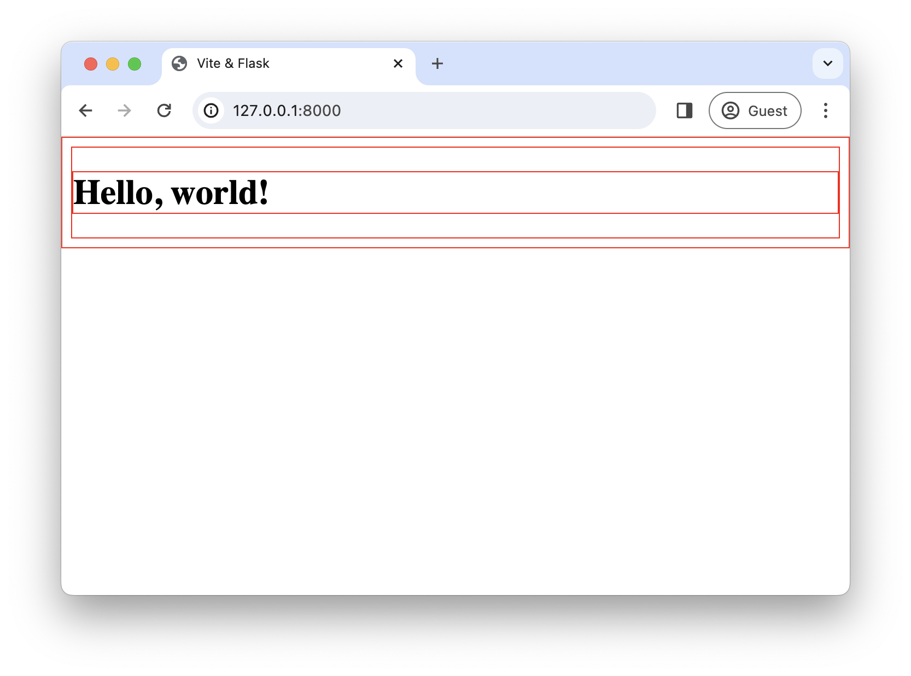

---
{
  title: "Build a Vite 5 Backend Integration with Flask",
  description: "Learn how to build a lightweight backend Vite integration using a Flask Blueprint in ~50 lines of code.",
  published: '2024-02-27',
  authors: ["tylerlwsmith"],
  tags: ["javascript", "python"],
  originalLink: "https://dev.to/tylerlwsmith/build-a-vite-5-backend-integration-with-flask-jch",
  license: 'cc-by-4'
}
---

The [Vite Backend Integration guide](https://vitejs.dev/guide/backend-integration.html) is light on details; it asks the reader to consider using an existing integration. This isn't helpful when an integration doesn't yet exist, or when you want to develop your own integration for a traditional server-rendered web application. I wasn't able to find a complete integration guide, so I decided to write my own that shares what I've learned about bundling with Vite.

This guide will show you how to bundle assets with Vite and build a lightweight integration with a traditional backend framework. The guide will use Python & Flask because they are accessible tools for developers across multiple ecosystems. However, the concepts could be applied to Django, Gorilla Mux, WordPress themes, and countless other backend technologies. 

> **TLDR:** you can view an example of [a completed Flask/Vite integration on my GitHub](https://github.com/tylerlwsmith/vite-with-flask-backend). The repo adds a few additional niceties (such as `gunicorn`) that aren't covered in this guide. Take a look at it if you would rather just read completed code.

## Understanding Vite

Vite's development & build stages are less cohesive than a bundler like Webpack, where the Webpack DevServer bundles the whole application on every change. Understanding the differences between Vite's DevServer and its Bundler will help while building an integration.

Vite is two separate-but-related things:

1. Vite is a **development server** that compiles assets on-the-fly. 
2. Vite is a **bundler** that packages assets for production.

Both Vite's DevServer and its Bundler are capable of processing JS, TypeScript, JSX, Scss, Less, and more. But only its Bundler bundles static assets for release.

### The Vite DevServer

Vite's DevServer was designed from its inception to make local development changes feel instantaneous. 

Unlike Webpack, the Vite DevServer only compiles files when they are requested. It leverages [ES module](https://developer.mozilla.org/en-US/docs/Web/JavaScript/Guide/Modules) imports, which allow JS files to import other files without needing to bundle them together during development. When one file changes, only that file needs to be re-compiled, and the rest can remain unchanged. Project files are compiled with [Rollup.js](https://rollupjs.org/). Third-party dependencies in `node_modules` are pre-compiled using the ultra-fast [esbuild](https://esbuild.github.io/) bundler for maximum speed, and they are cached until the dependency version changes. Vite also provides a client script for hot module reloading.

Within the Vite config, there is a `root` option that specifies the directory where Vite will look for unprocessed assets. When running the Vite DevServer, almost every file in the `root` directory is URL-accessible by its unprocessed filename (see [blocked files](https://vitejs.dev/config/server-options.html#server-fs-deny)). For example, `{root}/src/main.ts` would be URL accessible at `http://localhost:5173/src/main.ts`, and it would return the compiled JS file. However, this does not mean that every file in the `root` directory will be included in the production bundle (more on this in the [next section](#the-vite-bundler)).

Another interesting quirk of the Vite DevServer is _when_ and _how_ the compiling of an asset happens. Let's say the following Sass file exists at `{root}/example.scss` in a Vite project:

```scss
$border-width: 1px;
$border-style: solid;
$border-color: red;

* {
  border: $border-width $border-style $border-color;
}
```

When requesting the file, Vite's DevServer will look at the **`Accept`** header in the request to figure out what it should return. We'll use `curl` to demonstrate.

**`Accept: text/html`** is used by the browser when visiting a URL directly. Vite's DevServer will return the file verbatim if it has not yet been compiled.

```txt
$ curl -H "Accept: text/html" http://localhost:5173/example.scss

$border-width: 1px;
$border-style: solid;
$border-color: red;

* {
  border: $border-width $border-style $border-color;
}
```

**`Accept: text/css`** is used by the browser when loading a stylesheet using `<link rel="stylesheet" href="/example.scss" />`. This header tells Vite's DevServer to return the compiled Scss as CSS.

```txt
$ curl -H "Accept: text/css" http://localhost:5173/example.scss

* {
  border: 1px solid red;
}
```

**`Accept: */*`** is used by the browser when loading JavaScript. This header tells Vite's DevServer to return the compiled Scss as JS.

```txt
$ curl -H "Accept: */*" http://localhost:5173/example.scss

import { createHotContext as __vite__createHotContext } from "/@vite/client";import.meta.hot = __vite__createHotContext("/src/example.scss");import { updateStyle as __vite__updateStyle, removeStyle as __vite__removeStyle } from "/@vite/client"
const __vite__id = "/home/tylersmith/projects/vite-demo/src/example.scss"
const __vite__css = "* {\n  border: 1px solid red;\n}"
__vite__updateStyle(__vite__id, __vite__css)
import.meta.hot.accept()
import.meta.hot.prune(() => __vite__removeStyle(__vite__id)
```

Compiling the Sass file to JS allows it to be included in JS files using `import "./example.scss"`, and the compiled JS file will attach the styles to the DOM. Vite will cache this result and return it for future request using `Accept: text/html` and `Accept: */*` until the file is changed.

I wouldn't be surprised if this behavior evolves in future Vite releases, but it's useful to understand when debugging a backend integration.

### The Vite Bundler

Vite's Bundler wraps Rollup.js and adds a few Vite-specific capabilities. Unlike Vite's DevServer, Vite's Bundler bundles imported script files together instead of linking between them via ES Modules (which are fast on `localhost` but slow over the Internet). The build step will also create hashed asset filenames that help with cache-busting. Vite will optionally generate a manifest file of all bundled files, enabling an application to look up an asset's hashed filename using the asset's unprocessed filename.

Not all files in the `root` directory will be bundled. For a file to be included in Vite's production bundle, one of the following conditions must be true:

1. The file is a build **entry point** (more on this below).
2. The file is included directly or transitively by an entry point.
3. The file is in the `{root}/public/` directory (however, our integration will disable this feature).

An **entry point** is a top-level file in a bundle that will have an associated output file in the build. Vite allows multiple entry points in a project. An entry point can be an HTML file, a JavaScript file, a TypeScript file, an Scss file, or another supported file type that's listed on [Vite's Features page](https://vitejs.dev/guide/features.html).

During the build phase, Vite will ensure that all files referenced by an entry point (such as JS, CSS, and images) will be bundled. In our integration, the entry points will be styles and scripts.

## Defining the scope of our integration

Now that we are familiar with the core functionality of Vite, let's plan out our backend integration with Flask. 

Our integration will compile **TypeScript** and **Scss**. Unprocessed assets will live in a directory called `assets_source/`, and bundled assets will be written to `assets_compiled/bundled/`. The manifest will be written to `compiled_assets/manifest.json`, and it will not be URL accessible.

Jinja templates will have an `asset()` helper that accepts a source filename and returns the location of an asset. If Flask is in `debug` mode, the helper will return the URL for the asset on Vite's DevServer. Otherwise, it will return the absolute path to a compiled asset with a hashed filename.

```html
<script type="module" src="{{ asset('script.ts') }}"></script>
```

Templates will also have an `is_production` variable. It will be used to conditionally load the Vite client that enables hot reloading in development.

### Out of scope

Our integration will _not_ use the module preload polyfill (more info [here](https://github.com/tylerlwsmith/vite-with-flask-backend?tab=readme-ov-file#the-js-entrypoints-dont-need-a-modulepreload-polyfill)). It will also not refresh the page when Jinja templates are modified.

## Scaffolding the project

Create a new Vite project using the `vanilla-ts` template (you can find other template options in [Vite's Getting Started guide](https://vitejs.dev/guide/#scaffolding-your-first-vite-project)).

```sh
npm create vite@latest vite-flask-integration -- \
    --template vanilla-ts
```

Change into the newly created project directory and install its dependencies.

```sh
cd vite-flask-integration
npm install
```

Install Sass. Vite needs no additional configuration for Sass/Scss: it will work so long as it is installed.

```sh
npm install sass
```

Delete `index.html`, the `src/` directory, and the files within the `public/` directory. Our Flask project won't use these.

```sh
rm -rf index.html src public/*
```

With those files removed, build the following directory structure, leaving any files that already exist unmodified.

```txt
vite-flask-integration/
├─ assets_source/
│  ├─ script.ts
│  ├─ styles.scss
├─ node_modules/
├─ public/
│  ├─ robots.txt
├─ .gitignore
├─ package.json
├─ package-lock.json
├─ vite.config.js
```

Set the contents of `assets_source/styles.scss` to the following:

```scss
// assets_source/styles.scss

$border-width: 1px;
$border-style: solid;
$border-color: red;

* {
  border: $border-width $border-style $border-color;
}
```

Set the contents of `assets_source/script.ts` to the following:

```ts
// assets_source/script.ts

const greeting: string = "Hello, World!";
console.log(greeting);
```

Set the contents of `public/robots.txt` to the following:

```txt
User-agent: *
Disallow:
```

Vite won't use the `robots.txt` file, but Flask will.

## Configuring Vite, TypeScript & .gitignore

When a project's main directory contains a file named `vite.config.js`, Vite will load its configuration from that file.

Set the contents of `vite.config.js` to the following:

```js
// vite.config.js

import path from "node:path";

import { defineConfig } from "vite";

export default defineConfig({
  root: path.join(__dirname, "./assets_source/"),
  base: "/assets/",
  build: {
    outDir: path.join(__dirname, "./assets_compiled/"),
    manifest: "manifest.json",
    assetsDir: "bundled",
    rollupOptions: {
        input: [
          "assets_source/script.ts",
          "assets_source/styles.scss",
        ],
    },
    emptyOutDir: true,
    copyPublicDir: false,
  },
});
```

Let's examine these configuration settings.

### `root: path.join(__dirname, "./assets_source/")`

**`root`** specifies the directory for our unbundled assets (TypeScript, Scss, images, etc). We have set our root to `assets_source/`.

### `base: "/assets/"`

**`base`** specifies the base URL path where assets will be made available to the browser. We have set our base to `/assets/`, so if our site was `example.com`, the asset path would be `example.com/assets/`.

### `build.ourDir: path.join(__dirname, "./assets_compiled/")`

**`build.outDir`** specifies the directory where Vite will output the built files. The `outDir` is relative to the `root` directory, so we are joining from the main project directory and setting this to `assets_compiled/`.

### `build.manifest: "manifest.json"`

**`build.manifest`** specifies the path and filename for the manifest file that contains information about the project's assets. If set to `false`, the manifest won't be generated.

The manifest's path is relative to the `outDir`, and it **must** be a child of the `outDir` (workarounds [here](https://dev.to/tylerlwsmith/move-manifestjson-to-outdirs-parent-directory-in-vite-5-5fpf)). Because our `outDir` is set to `assets_compiled/`, the manifest file will be output to `assets_compiled/manifest.json`.

### `build.assetsDir: "bundled"`

**`build.assetsDir`** specifies the subdirectory within `outDir` where the bundled assets (JavaScript, CSS, etc) will be output. Since our `outDir` is `assets_compiled/`, our assets will be output to `assets_compiled/bundled/`.

### `build.rollupOptions.input: [...]`

**`build.rollupOptions.input`** specifies the **entry points** for bundling, indicating which files should be considered as entry points for the build process.

### `build.copyPublicDir: false`

When enabled, **`build.copyPublicDir`** instructs Vite to copy files from `{root}/public/` to `outDir` without applying any compilation. We have disabled this for our integration because we will use Flask to specify a public folder for static assets like `robots.txt`.

### `build.emptyOutDir: true`

When enabled, **`build.emptyOutDir`** instructs Vite to delete all files in the `outDir` before rebuilding. We have enabled this so that we don't accumulate stale assets.

### TypeScript

With the Vite configuration in place, overwrite `tsconfig.json`'s `"include"` array to inform TypeScript that the project's source code is located in `assets_source/`. 

```js
{
  /** Only modify the "include" setting in tsconfig.json */
  "include": ["assets_source"]
}
```

### .gitignore

Add the following Flask-related entries to `.gitignore`:

```py
# Add these anywhere inside .gitingore
__pycache__
.venv
assets_compiled
```

## Understanding what Vite builds

To understand Vite's output, first build the assets.

```sh
npm run build
```

The command will build the following files within the `assets_compiled/` directory.

```txt
assets_compiled/
├─ bundled/
│  ├─script-BkiISj8p.js
│  ├─styles-BBryp449.css
├─ manifest.json

other project files...
```

The generated filenames contain a hash before the extension. The hashes are used for cache busting. A hash is derived from the contents of a file, so a hash will only change when the contents of a compiled file change. This prevents browsers from loading a cached version of a file when its content changes.

The manifest file provides a mapping between the name of source files and their generated filenames that include the hash.

```json
{
  "script.ts": {
    "file": "bundled/script-BkiISj8p.js",
    "src": "script.ts",
    "isEntry": true
  },
  "styles.scss": {
    "file": "bundled/styles-BBryp449.css",
    "src": "styles.scss",
    "isEntry": true
  }
}
```

The `file` property of a source asset indicates where the output file is located relative to `build.outDir`. Our Flask integration will use this to look up the paths for generated assets.

## Creating the Flask app

Because this is a Python project, we need to set up a virtual environment to isolate our application's dependencies from the host system.

Create a virtual environment then activate it.

```sh
python3 -m venv .venv
source .venv/bin/activate
```

Install Flask.

```sh
pip install Flask
```

## Building the Vite Asset Blueprint

[Flask Blueprints](https://flask.palletsprojects.com/en/3.0.x/blueprints/) allow us to isolate pieces of a larger application into smaller cohesive modules. We'll use a blueprint to confine all of the asset-handling related Python code to one file.

In the main project directory, create `assets_blueprint.py` and set its contents to the following:

```py
# assets_blueprint.py

import json
import os
from pathlib import Path

from flask import Blueprint

# Get environment variables.
FLASK_DEBUG = os.getenv("FLASK_DEBUG", "0")
VITE_ORIGIN = os.getenv("VITE_ORIGIN", "http://localhost:5173")

# Set application constants.
is_production = FLASK_DEBUG != "1"
project_path = Path(os.path.dirname(os.path.abspath(__file__)))

# Create a blueprint that stores all Vite-related functionality.
assets_blueprint = Blueprint(
    "assets_blueprint",
    __name__,
    static_folder="assets_compiled/bundled",
    static_url_path="/assets/bundled",
)

# Load manifest file in the production environment.
manifest = {}
if is_production:
    manifest_path = project_path / "assets_compiled/manifest.json"
    try:
        with open(manifest_path, "r") as content:
            manifest = json.load(content)
    except OSError as exception:
        raise OSError(
            f"Manifest file not found. Run `npm run build`."
        ) from exception


# Add `asset()` function and `is_production` to app context.
@assets_blueprint.app_context_processor
def add_context():
    def dev_asset(file_path):
        return f"{VITE_ORIGIN}/assets/{file_path}"

    def prod_asset(file_path):
        try:
            return f"/assets/{manifest[file_path]['file']}"
        except:
            return "asset-not-found"

    return {
        "asset": prod_asset if is_production else dev_asset,
        "is_production": is_production,
    }
```

Let's walk through this code section-by-section.

First, the code grabs environment variables and sets default values if the environment variables are not set. The `FLASK_DEBUG` variable is set by Flask automatically, and it will be used to determine the app environment. If the value is `"1"`, the code will assume that the app is in development. The `VITE_ORIGIN` defaults to the standard origin of the local Vite server, but can be overwritten if Vite is using another protocol, hostname, or port.

Next, the code creates constants that will be used by the blueprint. The `is_production` variable will be used for determining if files should be served via the Vite DevServer or the filesystem, and the `project_path` will be used for locating the manifest file. While Python doesn't have a first-class notion of constants, the values of these variables will not change at runtime.

After that, the code creates the Flask Blueprint. The blueprint will eventually be registered with our yet-to-be-created Flask app. The parts that are important to notice during the blueprint instantiation are the static asset handling settings:

- **`static_folder="assets_compiled/bundled"`** tells Flask the filesystem path to our static assets. By setting the path to the `bundled/` subdirectory, we can keep `assets_compiled/manifest.json` private.
- **`static_url_path="/assets/bundled"`** is the bundled asset path that is defined in our Vite config. The directory must be `{base}/{build.assetDir}` from our Vite config in order for the compiled assets to work correctly.

Once the blueprint is created, the code will conditionally load the manifest file if the `is_production` constant is `True`. If the manifest file is not found, an exception will be raised that instructs the user to build the assets.

Finally, the code will pass the `asset()` helper function and `is_production` variable into the app context to be used by Jinja templates. The `asset()` helper will accept a path to a source file in the `assets_source/` directory, and it will return the location of that file. If the `is_production` constant is set to `False`, the `asset()` helper will return the URL for that file on the Vite DevServer. If the `is_production` constant is set to `True`, the `asset()` helper will look up the compiled file in `manifest.json` and return its absolute path. If a matching asset cannot be found in `manifest.json`, the `asset()` helper will return the string `"asset-not-found"`.

## Creating a Flask app

So far, we've scaffolded a Vite project, modified Vite's configuration, installed Flask, and built a blueprint for our Vite assets. Now it's time to put it all together by creating a Flask application.

In the main project directory, create a file named `main.py` and set its contents to the following:

```py
# main.py

from flask import Flask, render_template
from assets_blueprint import assets_blueprint


# Set up application.
app = Flask(
    __name__,
    static_url_path="/",
    static_folder="public",
    template_folder="templates",
)

# Provide Vite context processors and static assets directory.
app.register_blueprint(assets_blueprint)


# Setup application routes.
@app.get("/")
def homepage():
    return render_template("homepage.html")
```

This code creates an app, registers the assets blueprint, and creates a homepage route. It also exposes static files in the `public/` directory that Vite doesn't manage, like `robots.txt` or `favicon.ico`.

Let's create the last file for this project: `templates/homepage.html`.

```html
<!DOCTYPE html>
<html lang="en">
  <head>
    
    <script type="module" src="{{ asset('@vite/client') }}"></script>
    
    <link rel="stylesheet" href="{{ asset('styles.scss') }}" />

    <meta charset="UTF-8" />
    <meta name="viewport" content="width=device-width, initial-scale=1.0" />
    <title>Vite & Flask</title>
  </head>
  <body>
    <h1>Hello, world!</h1>
    <script type="module" src="{{ asset('script.ts') }}"></script>
  </body>
</html>
```

The `asset('@vite/client')` on the 5th line allows the app to use hot reloading. And with this, our app is complete.

## Putting it all together

Start Vite's DevServer.

```sh
npm run dev
```

In another terminal window, start Flask in `debug` mode on port `8000`.

```sh
flask --debug --app main run --port 8000
```

When you visit http://localhost:8000 on in a browser, you will see the following:



If you open the browser console, you'll see the following message generated by our `assets_source/script.ts` file:

```txt
Hello, World!
```

And if you view the page source, you'll see the following:

```html
<!DOCTYPE html>
<html lang="en">
  <head>
    <script type="module" src="http://localhost:5173/assets/@vite/client"></script>
    <link rel="stylesheet" href="http://localhost:5173/assets/styles.scss" />

    <meta charset="UTF-8" />
    <meta name="viewport" content="width=device-width, initial-scale=1.0" />
    <title>Vite & Flask</title>
  </head>
  <body>
    <h1>Hello, world!</h1>
    <script type="module" src="http://localhost:5173/assets/script.ts"></script>
  </body>
</html>
```

Our `asset()` helper that we created in the blueprint points to the files on the Vite DevServer at `http://localhost:5173` because Flask's `debug` mode is enabled. The HTML also includes the `@vite/client` that provides hot module reloading, allowing edits to the source files to be rendered to the browser without needing to reload the page.

Next, we can test the production settings. Stop Flask and the Vite DevServer. Build the assets, then start Flask without debug mode enabled.

```sh
npm run build
flask --app main run --port 8000
```

Now http://localhost:8000 will return the following HTML:

```html
<!DOCTYPE html>
<html lang="en">
  <head>
    <link rel="stylesheet" href="/assets/bundled/styles-BBryp449.css" />

    <meta charset="UTF-8" />
    <meta name="viewport" content="width=device-width, initial-scale=1.0" />
    <title>Vite & Flask</title>
  </head>
  <body>
    <h1>Hello, world!</h1>
    <script type="module" src="/assets/bundled/script-BkiISj8p.js"></script>
  </body>
</html>
```

The `asset()` helper now resolves the file paths using Vite's `manifest.json`, returning `/assets/bundled/styles-BBryp449.css` and `/assets/bundled/script-BkiISj8p.js`.

Lastly, you can view the files in the public directory registered by the Flask app. Visit http://localhost:8000/robots.txt to view `robots.txt`.

## Gotchas

A common mistake might be forgetting to add an entry point asset to `build.rollupOptions.input` in the `vite.config.js` file. If an entry point asset is not loading when using production settings, make sure it is listed in the `input` array.

It's also worth mentioning that this Flask application is not production-ready. At the very least, you'll want to put an application server like [Gunicorn](https://gunicorn.org/) in front of it (example in my [repo](https://github.com/tylerlwsmith/vite-with-flask-backend)). You'll also want to use a web server like NGINX to serve assets, or use a combination of [WhiteNoise](https://whitenoise.readthedocs.io/en/latest/index.html) and a CDN to deliver assets.

## A word of caution

Once you build a simple Vite backend integration, try not to complicate Vite's configuration unless you absolutely must. Vite has become one of the most popular bundlers in the frontend space, but it wasn't the first and it certainly won't be the last. In my 7 years of building for the web, I've used [Grunt](https://gruntjs.com/), [Gulp](https://gulpjs.com/), [Webpack](https://webpack.js.org/), [esbuild](https://esbuild.github.io/), and [Parcel](https://parceljs.org/). [Snowpack](https://www.snowpack.dev/) and [Rome](https://github.com/rome/tools) came-and-went before I ever had a chance to try them. [Bun](https://bun.sh/) is vying for the spot of The New Hotness in bundling, Rome has been forked into [Biome](https://biomejs.dev/), and Vercel is building a Rust-based [Webpack alternative](https://vercel.com/blog/turbopack).

Newer frameworks and tools focus on building integrations with newer bundlers. Consequently, using older bundlers becomes an uphill battle.

If history does indeed repeat itself, there will be new bundlers that replace Vite. Vite itself is even hoping to internally replace Rollup and esbuild with its own Rust-based bundler, which could break existing integrations. The more complicated a project's bundler configuration is, the more painful it becomes to upgrade and switch in the future.

This post gives enough guidance to build a simple Vite backend integration. But it may be as much of an integration as your project needs.
