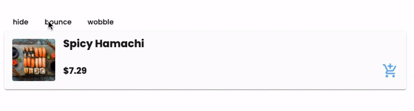

---
{
title: "Animate your Angular App using Animate.css",
published: "2021-09-22T14:22:17Z",
tags: ["angular", "animations", "css"],
description: "Most of you probably have heard of Animate.css. It is an open-source CSS animation library with lots...",
originalLink: "https://williamjuan.dev/blog/animate-your-angular-app-using-animate-css",
coverImg: "cover-image.png",
socialImg: "social-image.png",
collection: "Animations in Angular",
order: 2
}
---

Most of you probably have heard of [Animate.css](https://Animate.css/). It is an open-source CSS animation library with lots of predefined animations.

Animate.css groups their animations into categories such as entrances, exits, and attention seekers, each addressing a different use case. In addition, this library also lets us pass in flags to further customize their library of animations. These customizations include animation timing, delay, and iterations.

Instead of discussing the general usage of Animate.css, I'm going to focus on how you can use this library in your Angular application along with some tips and tricks I've learned using this library.

> For those of you who are interested in the demo and going straight to the source code. You can check those out [here](https://williamjuan027.github.io/angular-animations-explorer/post/third-party-libraries/animate-css)

## Installation

Add Animate.css's dependency either through the CDN or via npm. I used the CDN for this demo. Add the following code to your `index.html`

```html
<head>
  ...
  <!-- Animate.css -->
  <link
    rel="stylesheet"
    href="https://cdnjs.cloudflare.com/ajax/libs/animate.css/4.1.1/animate.min.css"
  />
</head>
```

## Use Angular's Class Binding

In a plain Javascript application, we would typically add a dynamic class by using the following code:

```javascript
const element = document.querySelector(".my-element");
element.classList.add("animate__animated", "animate__bounce");
```

The same could be done entirely in the template using class binding in Angular. To animate an element using Animate.css, we would need to add the class that contains the animation (see [here](https://Animate.css/) for a list of available classes) along with any static configurations. We can then bind that class to a property that triggers the animation. For example, if we want to trigger a bounce animation when a `boolean` value of the variable `shouldBounce` is `true`, we would bind the `animate__bounce` class to `shouldBounce`

```html
<div class="animate__animated" [class.animate__bounce]="shouldBounce"></div>
```



> To customize your animations (timing, delays, iterations, etc.), you can either add these classes directly to the `class` property of the element if they are static or bind them like the code snippet above if they are dynamic and depend on an external factor.

## Adding Javascript into the mix

The approach above works for most cases, however, it doesn't work if we want to trigger the same animation multiple times. For example, clicking on a button to execute the animation, and clicking it again to re-execute the animation.

This is by design, as Animate.css runs an animation by adding a class containing the animation, we wouldn't be able to retrigger the animation if the class is already added to the element. To work around this, we can use the `animationend` event to listen to when the animation is done executing, and remove the class that was added to trigger the animation. This allows us to add the classes again whenever we want to retrigger the animation.

```typescript
import { ViewChild, ElementRef } from '@angular/core';

...
export class AnimateStyleComponent {

    @ViewChild('cardContainer') cardContainer: ElementRef;

    bounceCard(): void {
        this._animate('bounce').catch((e) => {
        console.error('Error animating element:', e);
        });
    }

    private _animate(animationName: string, persistClass = false): Promise<void> {
        if (!this.cardContainer || !this.cardContainer.nativeElement) {
        return Promise.reject('element not defined');
        }

        if (this.isAnimating) {
        return Promise.reject('element is animating');
        }
        return new Promise((resolve) => {
        this.isAnimating = true;

        // listen to animationend to allow additional logic to be run
        // after the animation from Animate.css is done executing
        this.cardContainer.nativeElement.addEventListener(
            'animationend',
            (event) => {
            if (event.animationName === animationName) {
                this.isAnimating = false;
                if (!persistClass) {
                this.cardContainer.nativeElement.classList = '';
                }
                resolve();
            }
            },
            { once: true }
        );
        this.cardContainer.nativeElement.classList = `animate__animated animate__${animationName}`;
        });
    }
}
```

## Entrance and Exits

We can also animate entrances and exits by simply attaching the class conditionally.

```html
<div
  class="animate__animated"
  [class.animate__zoomInDown]="isShowing"
  [class.fadeOut]="!isShowing"
></div>
```


However, the above approach just animates the element in and out of the view, not necessarily removing the element from the DOM like what an `*ngIf` does.

Let me give you an example of what it looks like if we use an `*ngIf` and class binding entirely in the template.

```html
<div
  *ngIf="isShowing"
  class="animate__animated"
  [class.animate__zoomInDown]="isShowing"
  [class.fadeOut]="!isShowing"
></div>
```

The above code results in the following behavior.


Notice that the element only animates in and completely ignores the exit animation. This is expected as the `*ngIf` directive immediately removes the element once the condition is false without waiting for any animation to complete.

> You could remove the `*ngIf` and this animation would work. However, for certain types of animations, the element could still be left in the DOM and could be blocking the views behind it as it is not removed from the view, merely animated out.

To address this issue, we would need to approach it in a slightly different way, with a little help from Javascript.

To add and remove the element to and from the DOM, there is some additional setup we need to do. First, we will need to use an `ng-template` to wrap the component that we want to animate so we can add and remove it from the DOM. We'll also set the `opacity` to `0` to prevent the view from flashing before executing the enter animation. More on this later.

```html
<div #container></div>
  <ng-template #template>
    <!-- set opacity to 0 to prevent flashing before enter animation starts -->
    <div #cardContainer [style.opacity]="0">
      <app-card-demo-sample></app-card-demo-sample>
    </div>
  </ng-template>
</div>
```

We will then need to access the template reference and its container to conditionally add and remove the template from its parent container.

```typescript
export class AnimateStyleDemoComponent {
  @ViewChild("container", { read: ViewContainerRef })
  container: ViewContainerRef;
  @ViewChild("cardContainer") cardContainer: ElementRef;
  @ViewChild("template", { read: TemplateRef }) template: TemplateRef<null>;

  private _addCardToView(): Promise<void> {
    return new Promise((resolve) => {
      if (!this.viewRef) {
        this.container.clear();

        // add element to container
        this.viewRef = this.container.createEmbeddedView(this.template);

        // wrap this in a settimeout if it tries to animate before view is loaded
        if (this.cardContainer && this.cardContainer.nativeElement) {
          // set opacity to 1 to make element visible before starting enter animation
          this.renderer.setStyle(
            this.cardContainer.nativeElement,
            "opacity",
            1
          );
        }
        resolve();
        });
      } else {
        resolve();
      }
    });
  }

  private _removeCardFromView(): void {
    this.container.clear();
    if (this.viewRef) {
      this.viewRef.destroy();
      this.viewRef = null;
    }
  }
}
```

To animate the adding and removing of the element from the DOM, we will chain the adding/removing of the element and the animate function via promises.

For elements entering, add the card to view first, followed by the animate function. On the other hand, elements leaving will execute the animation first, followed by removing the card from view. We can verify this by adding `console.log` messages in the component being added/removed's `ngOnInit` and `ngOnDestroy` to check if these are called as the component is added and destroyed.

```typescript
export class AnimateStyleDemoComponent {
  private _showCard(): void {
    this._addCardToView().then(() => {
      this._animate("zoomInDown").catch((e) => {
        console.error("Error animating element:", e);
      });
    });
  }

  private _hideCard(): void {
    this._animate("fadeOut", true)
      .then(() => {
        this._removeCardFromView();
      })
      .catch((e) => {
        console.error("Error animating element:", e);
      });
  }
}
```


## Wrapping Up

That's all for now. I'll be adding more posts around different ways to add animations in Angular including Angular Animations, some cool libraries, and some tips and tricks. If you are interested in more content like this or have any questions let me know in the comments or tweet me at @williamjuan27
