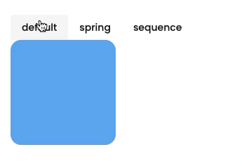
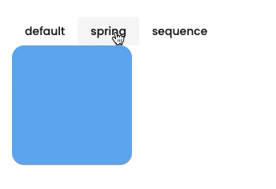
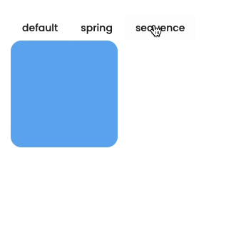

---
{
title: "Animate your Angular App using Motion One",
published: "2021-11-18T14:07:19Z",
tags: ["angular", "animations", "motion"],
description: "Motion One is a new animation library built on the Web Animations API. If you have used Popmotion or...",
originalLink: "https://williamjuan.dev/blog/animate-your-angular-app-using-motion-one",
coverImg: "cover-image.png",
socialImg: "social-image.png",
collection: "Animations in Angular",
order: 3
}
---

[Motion One](https://motion.dev/) is a new animation library built on the Web Animations API. If you have used Popmotion or Greensock before, this library's syntax should look very familiar.

In this blog post, I will show you how to use Motion One in an Angular application. I will walk you through the installation process, create a simple animation, and use Motion One's spring and timeline features.

> Check out a live demo I've created that you can interact with as part of my [Angular Animation Explorer](https://williamjuan027.github.io/angular-animations-explorer/post/third-party-libraries/motion-one).

## Get Started

First, we will need to add Motion One's dependency via npm using the following command.

```bash
npm install --save motion
```

> If you run into any typings issue from the library, try adding `skipLibCheck: true` to your tsconfig.json.

## Basic Animation using Motion One



To animate an element from your template, you will need to give it an id so you can access them from your Typescript file.

```html
<div #myElement>...</div>
```

You can then use Angular's `ViewChild` decorator to access the element defined above.

```typescript
import { Component, ViewChild, ElementRef } from '@angular/core';

@Component({
  ...
})
export class MotionOneDemoComponent {
  @ViewChild('myElement') myElement: ElementRef;

}
```

Now that we have access to your element, you can use Motion One's animation APIs to animate your element.

```typescript
import { Component, ViewChild, ElementRef } from '@angular/core';
import { animate } from 'motion';

@Component({
  ...
})
export class MotionOneDemoComponent {
  @ViewChild('myElement') myElement: ElementRef;

  animateMyElement(): void {
    animate(
      this.myElement.nativeElement,
      { rotate: 180 },
      { duration: 0.5, easing: 'ease-in' }
    ).finished.then(() => {
        // animation completed
      })
      .catch(() => {
        // if an error happens
      });
  }
}
```

## Spring and Glide Animation



Motion One also comes with prebuilt easing such as `spring` and `glide` which, you can use by passing in their respective functions with any additional configurations. The snippet below is how you create a basic spring animation using Motion One:

```typescript
import { Component, ViewChild, ElementRef } from '@angular/core';
import { animate, spring } from 'motion';

@Component({
  ...
})
export class MotionOneDemoComponent {
  @ViewChild('myElement') myElement: ElementRef;

  animateMyElement(): void {
    animate(
      this.myElement.nativeElement,
      { rotate: 180 },
      { duration: 0.5, easing: spring() } // 👈 modify the easing
    ).finished.then(() => {
        // animation completed
      })
      .catch(() => {
        // if an error happens
      });
  }
}
```

## Timeline Animations



Another cool feature from Motion One is its out-of-the-box support of timeline. You can chain your animations and animate different elements all at once by creating an animations array and passing it to the `timeline` function.

The `timeline` function works similarly to Greensock's timeline feature. The code snippet below shows how you chain and sequence a translation of a box.

```typescript
import { Component, ViewChild, ElementRef } from '@angular/core';
import { timeline } from 'motion';

@Component({
  ...
})
export class MotionOneDemoComponent {
  @ViewChild('myElement') myElement: ElementRef;

  animateMyElement(): void {
    const sequence = [
      [this.myElement.nativeElement, { x: 100 }, { duration: 0.5 }],
      [this.myElement.nativeElement, { y: 100 }, { duration: 0.5 }],
      [this.myElement.nativeElement, { x: 0, y: 0 }, { duration: 1 }],
    ];
    timeline(sequence)
      .finished.then(() => {
        // animation completed
      })
      .catch(() => {
        // if an error happens
      });
  }
}
```

## Wrapping Up

Motion One is a relatively new animation library compared to other animation libraries out there. However, it is feature-rich, performant, and easy to use. This blog post only covers a small percentage of the library's capabilities. I will be exploring more of Motion One's features in the future and write a follow-up blog post covering more advanced uses of this library.

If you are interested in more content like this or have any questions, let me know in the comments or tweet me at [@williamjuan27](https://dev.to/williamjuan27)
