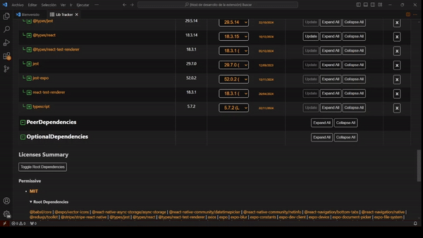

---
{
  title: "LibTracker Updates 12/10/24: Get to personally know your apps with this simple SBOM Tool",
  description: "Updates to the LibTracker Vscode Extension. Simplify dependency management with this simple SBOM tool",
  published: '2024-12-10',
  tags: ["LibTracker","SBOM","DependencyManagement","SoftwareLicenses","SecurityVulnerabilities","VisualStudioCode","VSCodeExtensions","SoftwareDevelopment","OpenSource","SoftwareEngineering","ApplicationManagement","DevTools","GitIntegration","CVEInsights","SoftwareBillOfMaterials","DeveloperTools"],
  collection: "LibTracker",
  license: 'cc-by-4'
}
---

We are excited to announce the latest updates to *LibTracker*, our VSCode extension designed for professionals to simplify software bill of materials (SBOM) management. With LibTracker, you can effortlessly analyze and manage your apps, ensuring up-to-date versions, addressing security vulnerabilities, and resolving licensing issues—all at a glance.

Access it here: [LibTracker on VSCode Marketplace](https://marketplace.visualstudio.com/items?itemName=windmillcode-publisher-0.lib-tracker)

### New Features in the Latest Release:
- **Latest Stable Version**: We’ve added the ability to display both the latest version and the latest stable version of each dependency. This ensures you can make informed updates without risking app stability.

### Upcoming Features:
- **App Detail Page Enhancements**:
  - Integration of CVE details for all dependencies and subdependencies.
  - Search functionality extended to include nested child rows.
  - Responsive design updates to allow a card-based layout for improved usability.
- **Replace Action with Icons and Tooltips**: Replace actions with icons, complemented by tooltips for clarity.
- **Recursion Exclusion List**: Add an exclusion list for recursion to manage directories and files efficiently.
- **Workspace Folder Management**: Development depends on the VSCode API’s capability to support VSCode profiles.
- **SBOM Generation**: Generate SBOM for projects and apps.

### Future Milestones (Exploring Feasibility):
- **Git Backup Changes**: Streamline version control and backup functionalities.
- **AI-Powered Summaries**:
  - Automate generation of license and CVE category summaries.
  - Include URL or AI-generated summaries for license and CVE details.
- **Subdependency Navigation**: Enable linking from subdependencies in the license pane to their locations in the dependency table.
- **Advanced Table Features**:
  - Expand and collapse all subtables within rows.
  - Responsive design updates to allow a card-based layout at smaller viewports.
- **Unused Package Management**:
  - List all unused packages in the app.
  - Remove unused packages from the app.

