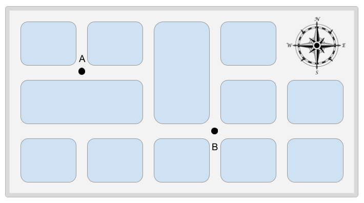
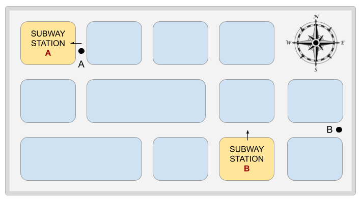
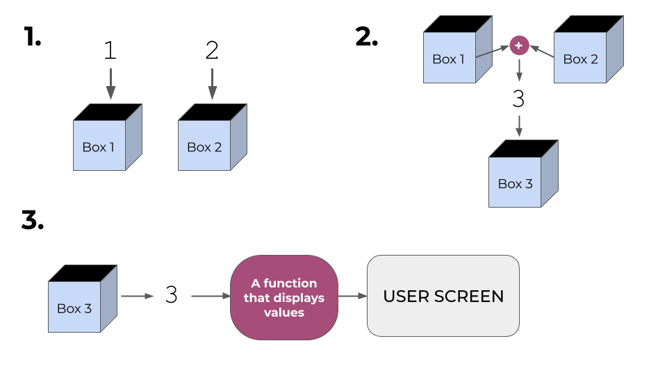

---
{
	title: "What's An Algorithm?",
	description: "A quick introduction into what algorithms are, what they're made of and why they're an important part of understanding how programming languages work",
	published: '2022-08-26T18:00:00.000Z',
	tags: ['computer science'],
	license: 'cc-by-nc-sa-4',
}
---

If you ever used GPS instructions to get somewhere, or followed a recipe book to make apple pie, or even dialed a phone to call a friend, then you already executed what you can call an **Algorithm**.

In simple terms, an algorithm is a set of instructions that lead to a certain result. If you execute it correctly, you get the result you wanted, a delicious apple pie!
But if you somehow mess up an instruction (like leaving the pie in the oven for 2 hours instead of 1 hour like the recipe book tells you to) then you end up with a bad result, and you would have to start over.

The same thing applies for machines. If you give a computer a clear set of instructions, it’ll execute them in order to reach the desired result. There is, however, a huge difference between telling another person how to solve a certain equation, and telling a computer to do the same thing, because computers have [their own language](/posts/how-computers-speak#hdd), which is very different from human language.

However, if you understand what an algorithm is, and how to break down tasks into a small set of very basic instructions, it will be a lot easier to deal with programming languages later in your learning journey.

# Algorithms & Computers

To emphasize why the concept of algorithms is very important, you have to understand that an algorithm describes the steps that need to be taken (from **START** to **END**) to do a certain task, independently from any programming language.
In other words, no matter what programming language people use for a certain task, the same “thought process” can be applied everywhere.

Let’s say you are asked to write down the instructions needed to go from point **A** to point **B** as shown in this map below:



A very basic algorithm can be written down as such:

```elixir
START
	- Head East
	- Head South to the intersection
	- Head East to the intersection
END
```

The instructions are pretty straightforward, so anyone can follow them. Of course there are other routes you can take to get to point **B**, so you can make your set of instructions as simple or as complex as you want to, but you’ll learn with time that sometimes, just because there are very few instructions, doesn’t mean that your algorithm is the most efficient.

Let’s look at the example here below:



Here we can do one of two algorithms to get from point A to point B:

**Algorithm N°1:**
```elixir
START
	- Head South
	- Head East
END
```

**Algorithm N°2:**
```elixir
START
	- Enter subway station 'A'
	- Take the subway to subway station 'B'
	- Exit subway station 'B'
	- Head East
END
```

While Algorithm N°1 has only **2 instructions**, it would take someone more time and energy to walk from point A to B, while if you follow Algorithm N°2, it has **4 instructions**, but you get to save time and energy compared to the first Algorithm.

The same thing goes for a computer program, sometimes, just because there are a few lines of code, doesn’t mean it’s gonna run the fastest or be the most performant.

But before we can get into what makes an algorithm fast or better suited for one task or the other, let's first look at what an algorithm can be made of.

# Building blocks of an algorithm

Let’s take a look at an example that has something more to do with computers: *a basic arithmetic operation.*

If you were asked to calculate 1 + 2, it would take you less than a second, because in your brain “it’s obviously 3”, right? But what if you were asked to break down that operation into steps like we did in the previous example?

If we follow the same thought process as before, we could write something like this:

```elixir
START
	- Take the number 1
	- Take the number 2
	- Add them together
	- Obtain the number 3
END
```

That's a pretty simple algorithm. But for a computer to be able to take two values and apply an arithmetic operation between them, it needs to store them somewhere first before it does anything with them, which brings us to out next point: "**Variables**"

## Variables

In any computer program, we often have to temporarily store values for different operations. These values can be inputs _(from the user through the keyboard)_ or from the computer storage, or sometimes even values from other operations made by the computer itself as shown in this example:

**_Calculating 2 to the power of 3_**:
```elixir
START
	- Take the number 2
	- Take another number 2
	- Multiply 2 by 2
	- Obtain the number 4
	- Take another number 2
	- Multiply 4 by 2
	- Obtain the number 8
END
```

In the fourth step, we have to store the value **4** which is returned by the computer itself, in order to multiply it again by the number **2** to get the final result.

> Values stored by a computer don’t always have to be numbers though, they can also be letters *(known in programming languages as characters, like a, b, k, y…)*, words *(known as “strings”, which means “strings of characters”)*, and other types of variables that you’ll meet later on as you deal with programming languages.

Whenever the computer needs to store a value of any kind, it uses what we call a “Variable”.

A variable can be initially considered as a box to keep things in. And since there can be millions of "boxes" inside a computer, we need to differentiate them, which is why each one has a unique name, address (where it's kept in the memory), etc.

So, for any value that needs to be used, we can ask the computer to create a unique **variable** and **assign** our value to that variable so that we're able to use it throughout the code.

To illustrate how that works, let's look at this visual representation of how addition between two values happens:



If we want to be even more specific on what happens inside the computer, we could re-write the algorithm like this:

```elixir
START
	- Take the number 1 and put it in a box called Box1
	- Take the number 2 and put it in a box called Box2
	- Add them together and put that value in a box called Box3
	- Display the value of Box3 on the screen
END
```

You will notice in our illustration that there's a block that says "A function that displays values", but ignore that for the moment because we'll get to what functions are in a few.

> A more extensive explanation on how computers store and handle variables can be found [here](/posts/how-computers-speak).

Now that we've established how values are stored, comes the part where the computer handles the different instructions given, with the help of what we can call "**Operators**"

## Operators

In any programming language, you'll find a set of different symbols used to execute specific operations on either one variable, or between 2 or more variables.

The simplest (and most common) ones are arithmetic operators: **Addition (+), Subtraction (-), Multiplication(x) and Division (÷)**

> Note that in several programming languages, the 4 arithmetic operators can be used for more than just mathematical operations between numbers. A simple example is adding two words together in JavaScript to form another word, as such: `"Mathe" + "matical"`

There are of course other operators that you'll get into as you start coding, but we won't get into all of them. Instead we'll look into one that is very common, and that's the **Equal sign =**
As opposed to how it's usually used in simple arithmetics, as the part to indicate "this is the result", in most programming languages, it actually means something completely different.

Let's take a look at the same example we used before, where we added two numbers together, and take the first instruction:

`- Take the number 1`

If we take into consideration the part where we talked about "storing values", we mentioned "**assigning**" values to variables. The **Equal sign (=)** is what we can use to _'put'_ values into variables. So a more exact way of describing that instruction would be:

`- Assign the number 1 to a variable`

With all of that put into consideration, let's try to write an algorithm that is a little bit more comprehensible to a computer:

```elixir
START
	- Assign the number 1 to a variable
	- Assign the number 2 to another variable
	- Add the values of the two variables together
	- Obtain the number 3
END
```

All of this sounds great! However, we're still dealing with very simple operations. So what about big complex instructions? Like if we take a calculator, and try to calculate the **square root** of a certain number, how does it do that? Especially considering that the computer can't understand "Square root", and can only do very basic operations.

To do that, we'd have to create specific "sets of instructions" that we can call for specific steps. Those sets of instructions are called "**Functions**"

## Functions

A function is a set of instructions that is defined _once_, but can be used _as many times as necessary_. In other words, it's a "pre-made chunk of simple instructions used to perform a complex task on demand".
For different purposes, we can create different functions to make performing tasks easier for ourselves.

The big advantage of making a function is to be able to quickly and easily use it without having to write the entire set of instructions over and over again, because over time you'll see that some tasks have to be performed hundreds of times in an applications, and to make all of that easier, functions are the way to go.

A good example where these functions can come in handy is when trying to do bulk-tasks, like cooking multiple pies at once:

```elixir
BAKE_START
   - Pre-heat the oven to 350
   - Put the pie in the oven
   - Wait an hour
   - Take the pie out of the oven
BAKE_END
START
	- Prepare apple pie
	- Prepare rhubarb pie
	- BAKE apple pie
	- BAKE rhubarb pie 
END
```

Here we are calling the `BAKE` function instead of writing the instructions over and over each time we need them.

# Pseudo-code vs. Programming languages

Now that we covered the essentials of what an algorithm is and how to break down tasks into instructions or “pseudo-code”, let’s have a little taste of programming languages, by comparing an algorithm (written in English) to how it’s written in two different programming languages.

Let’s take our previous example where we calculated 1 + 2, and see how it’s written in two of the most popular programming languages nowadays: JavaScript and Python.

**Pseudo-code:**
```elixir
START
	- Assign the number 1 to a variable
	- Assign the number 2 to another variable
	- Add the values of the two variables together
	- Obtain the number 3
END
```

**JavaScript:**
```javascript
variableOne = 1;
variableTwo = 2;
console.log(variableOne + variableTwo)
// We obtain the number 3
```

**Python**
```python
variableOne = 1
variableTwo = 2
print(variableOne + variableTwo)
# We obtain the number 3
```

If we compare the 3 different programs line by line, we can see that the steps are exactly the same:
- We put the number 1 in a variable (that we call variableOne in this case)
- We put the number 2 in another variable (that we call variableTwo)
- We “Add the two values together” using the + operator.
- We get the result, which is 3

> Note that `console.log` and `print` are functions in JavaScript and Python respectively, used to log values for the user to see on screen.

So, as we already mentioned in the beginning of this article, we can see that the thought process is in fact the same whether we use pseudo-code, JavaScript or Python (as is the case with so many other programming languages).

Of course there’s a lot more to programming languages than these steps, especially considering what we've talked about in the "Functions" section. But this will hopefully give you an idea on how they work in general, and how you can break down any process before you actually write in in JavaScript or Python or any other language you may get into as you go further into coding.

# Conclusion

Algorithms are not an alien concept to anyone, since each of us tends to follow different sets of steps to achieve the different tasks we run into everyday, and in this article we covered how to break down any task into very small steps and how that concept is exactly how a computer runs programs.
And despite the many different ways a program can be written, there's no correlation whatsoever between how long the code is and how performant it is, because as we've seen, an algorithm can be made of multiple instructions that could require either small operations (like addition or subtraction) or complex functions (made up of multiple small operations).
Those basics, along with the sneak peek we had into actual programming languages, will hopefully serve as a good base for what's up ahead! But If you have any questions at all, make sure you drop a comment below, or [join our discord community](https://discord.gg/FMcvc6T).
